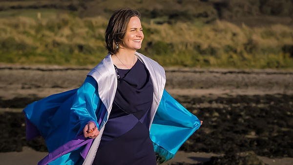
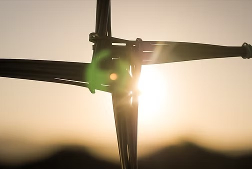
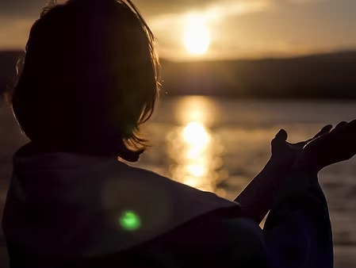

# Helen Cantrell

RainbowStarlight
----------------

Sacred songs, chants and mantras stemming from a rich heritage of ancient wisdom and tribes from around the world are known to uplift, enliven and reconnect us to our hearts and deepen our relationship with life and creation. They capture something very magical and resonate deep with our souls.

I have been learning and singing these sacred songs for the past 10 years at sacred ceremonies. I facilitate sacred song circles and hold a sacred space for people to come and learn to sing these native chants and songs from across the globe.

These song circles are designed to encourage you to use your voice to help connect you to your hearts wisdom and the natural world around us. They help shift our awareness from our minds so that we can become heart centred once again, feel connected to life and feel good while singing!

Song booklets are provided and each gathering is different from the last catering for whoever attends. No experience is necessary. So whether you are an opera singer, choir singer or just love singing in the shower you are very welcome to join the circle.

Regular sacred song circles are held in Co. Sligo on a monthly basis. [Contact Helen](https://mederiamatsuclinic.com/contact-me/) for further information.

NEW SONG ‘BRIGID OF THE FLAME’ LAUNCHES  
\- RAINBOW STARLIGHT RELEASES A POWERFUL NEW SONG IN CELEBRATION OF  
ST BRIGID’S DAY -

Sligo based singer-songwriter, Rainbow Starlight releases her second song, ‘Brigid of the Flame’,  
honouring the Saint and Goddess Brigid this week.  
This stunning arrangement takes us on a journey with Brigid, invoking a remembering of Ireland’s ancient past, its’ myths and stories.  
Release Date: Imbolc, Thursday 1st February 2024  
Starlight brings her unique musicality and her deep connection to the land and Celtic stories, to craft this powerful piece.  
She says; “The spiritual connection of the Irish people to the nurturing energy  
of the Feminine has always endured. Through Mother Mary shrines across the land and the sacred holy wells of St. Brigid, it has always been present.”  
Starlight’s music has long been inspired by the multi- faceted spiritual traditions of Ireland.  
Following the success of her first single ‘Ón Mháithair’, collaborating with Clannad’s Pól Brennan and musician Seán Mulrooney in 2021, her latest composition is a joyful and soul-stirring melody crafted in celebration of the Saint and the Goddess Brigid of Ireland.  
Starlight says; “I wrote this song to honour Ireland’s new national holiday that is dedicated to one  
of our great heroines and modern icons. It is a celebration of the Brigid that we all know and love,  
the Goddess, the healer, the Saint, the seer, the keeper of the flame and the protector of the waters.  
“This song conveys the strength of the Divine Feminine and the compassion and love that Brigid  
had and still has for Her People” she adds.  
‘Brigid of the Flame’ was recorded in the centre of the Irish landscape in Co. Cavan and was shot on the majestic land of Co. Sligo, a place rich with history, myth and legend. The video and song work beautifully together to bring forth Brigid’s perpetual flame and the golden thread of the Feminine that runs through Ireland’s ancient past and present alike.  
‘Brigid of the Flame’ releases on Thursday 1st February at 11.11am and will be available online via Bandcamp, Spotify and in all main music distributer stores. The video premieres on YouTube at the same time 11:11am Thursday, 1st February and can be viewed here Rainbowstarlightmusic.Media Enquiries:  
Helen Cantrell  
087 6997958, [email](mailto:Rainbowstarlightmusic@gmail.com)
Bio: Rainbow Starlight is a singer-songwriter and a Song Carrier. Inspired and influenced by many different indigenous traditions across the globe she holds a large repertoire of sacred songs, chants and mantras. She held the post of lead ceremonial drummer for a number of sacred gatherings both in Ireland and Wales until 2023 and recently completed a 12 year spiritual and shamanic apprenticeship under the guidance of Arwyn Dreamwalker, a medicine woman and healer of Celtic and Native American Shamanic Traditions.

Ón Mháthair
-----------

Ón Mháthair - A new powerful and ethereal melody and composition by Rainbow Starlight for one of Ireland’s best loved ancient Irish prayers, ‘Sé Do Bheatha a Mhuire’. ' Collaborating with Pol Brennan from Clannad and Sean Mulrooney from Tau and the Drones of Praise, Ón Mháthair was filmed live at the Chapel of Ease Church in Dublin and on the sacred mountain of Knocknarea, Co. Sligo, Ireland. This song calls to everyone of the island of Eiriú (Ireland) and across the globe to come together, to walk together, to deepen our commune with the land we live upon and to stand for right action with sovereignty of heart for the children and the future generations. It is time.

Sacred Song Circles
-------------------

Helen has run sacred song circles for over 6 years in Sligo and in 2021 undertook two Cacao Mastery courses. She has run many sacred song and cacao circles since and finds Cacao's beautiful rich heart warming medicine a nourishment for the soul!

Helen shares her passion for music, sacred songs and sounds and her love for Cacao through these gatherings of community in circle that always help lift the heart, reconnect us to our own authentic voice and bring happiness, joy and peace.

More details on Sacred Song & Cacao Circles with Helen:

We will begin the evening with opening prayers and then drink our Cacao setting our intent for the ceremony. We will then sing sacred songs from across the globe to help us journey into our hearts and hear guidance from Mama cacao.

Cacao Dose:

I will be making the cacao (25g each) with water and will have it in a flask ready to drink upon the opening of the ceremony. If you do want to make it lighter for you please let me know as soon as you can and I can make it for you in a separate flask. This will be 16g.

As Cacao is quite bitter I will bring some honey to add to it.

Safety and Contra Indications:

Generally, cacao is safe to drink.

Some people may develop a headache or nausea, in part because cacao can be dehydrating. I find by drinking some water before and after taking cacao helps with this.

Contra- Indications:

There are only a few contra indications for Cacao but because it has several mood enhancing properties I would ask those that are taking anti-depressants or have a serious heart condition to consider not attending. If you have any questions with regards to this please get in touch.

\*\* Any questions on any of the above or anything at all give me a ring. I'm on 0876997958 and you can also contact me at this email address: [helencantrelltherapy@gmail.com](mailto:helencantrelltherapy@gmail.com)

Cacoa and Heart blessings,

Helen/Rainbow x
