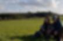

# From Karen.....
---------------

I have been visiting Monamanry for about 20 years, in the early days before I knew much about sacred places, this mysterious place spoke to me, in a language my body understood.

My Story
--------

Twenty years ago when my children were in primary school, standing outside the school gates chatting with other mums, I heard whispers of a an ancient place called Monamanry. These were the days where we needed directions, and didn't have GPS on our phones.... directions like follow along that boreen till you see the grass in the middle of the road and then after two miles turn left, when you see the sheep in the field at the top of the road you are nearly there.

Another mother had given me directions which I followed to the letter every time, but Monamanry proved elusive.

Eventually after the third time searching, in  townlands called the Swan and Wolfhill, and Luggacurren...I realised I was in the wrong field...it was the next field up.

I felt her calling me like when the hairs on the back of your neck stand on end for no apparent reason, where even the silence has a ring to it, a higher vibration than most places. First of all the deterring sign of Beware of the Bull, and having to climb the gate in order to access this beauty its not until you are at the top of the hill before you see how big and beautiful this stone circle is, and how awe inspiring the sky and surrounding hills are. I was speechless.

I walked around the outer stone circle 3 times before entering, each time taking in the breath-taking views. You can see at least four counties from that spot on a clear day, but in the mist of early morning the stone circle draws you in to its womb like centre, and huge alter stone.

I knew nothing of the history of this ancient place other than its name, Monamanry, but felt a powerful divine feminine, wild woman warrior, energy about the place, and the old chants that had been passed to me, gurgling in my womb...was this alter-stone a birthing-stone?

The chant that came through me was one of the very first sacred chants I had been passed as a song carrier, with it, a responsibility to sing these songs back into being, to the land at the ancient and sacred places , a chant so old that the full translation has been lost, written in the original Goddess language Maat Mari, it speaks of calling and welcoming the Wild God back through the spheres in celebration and victory.

The last line speaks of 'tir na moe'....land of the bog, but another translation is 'land of the living heart' or 'heartland'.

As I sat chanting and drumming with this ancient song, on the soft lush grass, Monamanry awakened herself.

Exquisiteness of the crystal clear air, the bull raising his head in curiosity, ravens circling overhead, the distant call of a red kite. Monamanry....

Moe Na mBan Rí, Heartland of the Women Kings...

The gurgling in my wombspace spoke to me with a softness, this is a place of pristine untouched energy, elusive even to those who search for it...like the teacher and the student, when the student is ready the teacher will present herself.

Living Heartland of the Women Kings, calling the Wild God back through the spheres, in welcoming celebration. Wild Women Warriors gathering, for ceremony, to teach, to share, to sing, to pray, to feast, to birth, to nurture,... I had visions of who were those wild women who gathered on this land.

Queen Medbh, Éiriú, Danú? Bridget surely cast her cloak here too, was this where Fionn mac Cumhaills aunts Bovmall and Lia Luachra learned how to teach the young warrior?

There is a distinct feeling of reverence to this place, knowing in the surrounding fields are the remnants of famine villages, and that battles fought in these hills, there is a serenity in this encircled wombspace of grace, and ease of the Mother.

​

Every time I have spent time here I have always had the feeling that Monamanry is elusive for the reason that the women kings have deep secrets to share, but only with those who have the courage to dance with there wild warrior divine selves, those who have the warrior courage to live through their hearts with authenticity, and those who listen for the lost songs of our ancient places.

​

The ancestors speak in loud voices to those who are willing to listen for the heart beat of the lands.

From Sinéad
-----------

Móin na Manraí

On a warm summer evening in the late nineties I walked through a four cross roads on an adventure to Monamanry.

Guided by Sionnach Dubh through the rural backroads not far from  
my parents house.

I was excited and enthusiastic about my spiritual journey and the legend of  
The Druids Altar and it's mysterious surroundings and heritage.

Locals called it "The Plateau of the Druidessess" and the magical name and mystery surrounding it's origins were conjuring some deep thoughts and wonderment. I couldn't wait to set foot on the hill and finally experience myself the sacredness and magic the stories had spoken about.  
As I climbed the gate and observed the little hump on the horizon for the first time I couldn't help but feel some deep memory of being at this place before but I kept walking through the tall grass and felt that feeling of being watched even though there wasn't anyone around the open field. Cows called in the distance as if to say welcome.  
As I walked with my knowledgeable companion we started to have the view from the circle towards the plains below. Twinkle lights from the villages and towns below kept appearing until we finally reached our destination and stood beside The Druids Altar admiring a view of the land.

Seven counties can be seen with vast views of the Dublin and Wicklow mountains and  
The Hill of Allen. My breath was taken away by such beauty.  
The wind blew (as it always does) against my back, cleansing and circling and I felt

cleansing and circling and I felt ready to  
enter the circle.

On Monamary Full Moon Equinox March 2022

My companion motioned to come into the circle from the east and cleansed my essence and said a silent prayer as I did.  
After various protections, calling and asking permissions we felt it was permitted to enter the centre of the circle and we sat by the centre stone in silence. As I sat I felt the energies of millenniums of lives, the magic of the land embodied in the ancient stones. Through them I remembered, my companion channelled and I saw the lifetimes that we had done this together before. I saw myself living other lifetimes at this place. I felt so privileged to be part of it all and blessed to have such a sage companion to teach me the secrets and reverence the circle held.

We thanked the land and circle and I left, forever changed by the  
experience. Many things came and went since, Monamanary was visited on occasion always there for me to remember and because my soul companion passed away since I marked some anniversaries by visiting and feeling connected again.

Weird and wonderful things have come about up there on many occasion, it's peace and tranquility is healing.

Finally four years ago I moved back to the area and am so blessed to be within walking distance. Sometimes I am called there and can't shake the feeling until I am sitting in the centre. Some days I go to visit and am told no, whether it's a nearby bull being the gatekeeper or just that feeling of " not today" and I listen and respect it. I always ask permission, I will always be respectful and I always say thank you. I hope Monamanary let's everyone see it's magic and people get to feel it's sacredness for themselves and future generations feel the energy and magic.

Rachelle's  
Story
------------------

Born and raised in Pennsylvania, United States, Ireland was the first international trip I took back in 2018, age of 22, with a group of friends. This sacred place, and all its magic, will forever be cherished in my heart. At the time, I presumed I was adventuring to Ireland to support a friend who felt deeply called to the lands and initiated the trip, to explore and to enjoy a new experience..

Little did I know the land was calling me, too, and it was of no coincidence or happenstance that I came. Each of us there for our own destined known and unknown reasons, receiving the codes and remembrances meant for us. There was a felt experience that my mind couldn't quite comprehend, but my body was in full communion with. Connecting to the consciousness of the preserved lands, and the way that energy connects to the Greater Whole, has a way of bringing you back to yourself. It was palpable and felt. So many spontaneous tears, emotional clearing, healing of the spirit and a feeling of coming home to myself. Our group was guided by two priestesses on the journey through Ireland, who introduced us to Karen- another powerful fellow medicine woman, priestess and wisdom keeper.

We visited many wildly beautiful places during our time, one of them being the lovely Monamanry. What an absolute honor and privilege. When we arrived at Monamanry, Karen shared with us the sacred and historical significance of the land- giving words to the undeniable feeling already present. The pulse of aliveness, elemental magic and concentrated life force the space holds is undeniable. We honored the land, we honored the space, we approached the stone circle with intention, we sang, we gave offerings, we connected to our hearts and to each other, and we re-membered. Monamanry is a very unique sacred site and experience, holding space for myself and so many others to feel, connect, remember and heal.

I share this with the intention to shed light upon the importance of Monamanry, as well as the importance of all sacred sites. May we advocate for these lands by using our voice to share what they communicate beyond words. May we hold space for these sites the way they hold space for us. By coming home to them, we come home to ourselves. I call on Great Mother, Great Father and all benevolent expressions to protect this space of Monamanry, to not allow any action that's not of the highest for this site and our lands to take place. Monamanry, my prayers surround you. May you continue on strong- sanctified and honored. Monamanry, Ireland, my life has changed since being held by you. I look forward to continuously building a relationship with you and fiercely protecting you in any way I can.Thank you, thank you, thank you. I love you.

\- Rachelle Woodard

Pennsylvania, United States

Erin's Story
------------

I have had the fortune to visit Monamanry twice. The first time, the sacred stones were surrounded by a thick and mysterious mist. My Irish friend who had taken me to this spot explained to me its history as a sacred place for the women to gather.

As I stood there, listening to the ancient stones, touching them, I could hear voices in the mist. It was as if we were surrounded by the spirits who once used that land in life. I turned to my friend, Karen, she heard it too.

The hearts of those who had prayed and celebrated in this place were still there. And they were watching us.

Once I finished my honouring and gave an offering to the stones, the mists lifted quickly and we saw friends of ours walking towards us. Friends who lived in this wonderful little hillock. Who knew its secrets. They came to join us in our honoring and joy that the land brought us.

The second time I visited I was bringing a group from the US. As I planned our tour of Eíre, I knew I had to include this wonderful spot for my tour patrons to visit. When we did arrive, my companions couldn’t stop speaking of the beauty of this spot and the intensity of the presence of the sacred spirits of this land. We drummed and sang and remembered. We remembered our old selves. We called in the many circles of women who had gathered there over the ages. We felt them gather with us, take our hands, and show us how important this simple piece of land truly was.

From a corner of the US Rocky Mountains, I share this information along with a heartfelt plea to spare this sacred site from the visual and energetic blight of a wind farm. The physical vibration alone is harmful for the surrounding flora and fauna. Not to mention the harm to land and animals that the destruction of construction involves.

Monamanry has been a sacred site for so long that we can’t even trace it. It is impossible to put a price on something so invisibly valuable to so many, alive and dead. Please, for the sake of the land and her people past and present, spare this location and keep it sacred.

Thank you, Erin McHugh.

Colorado, USA.

Sioban's Story.
---------------

I welcomed the equinox sunrise this morning at the ancient site of Monamanry.

This sacred site is known locally as the Druids Altar, a megalithic structure hidden deep in the misty hills between Wolfhill and Luggacurren, Co.Laois.

​

​

​

​

​

​

​

​

​

​

​

​

​

​

Officially translated as “bog of the mangers”, locals also translate it as the “bog of the women kings”. Stories say that this place was a holy place, led by Druidesses and Warriors. A place for fertility, for the land animals and the people.

Many generations over thousands of years have come to this site to honour the seasons, to celebrate the cycles of the sun, the moon and the cosmos. It is a wonder to me that some ancient ancestors over 3,000 years ago sat in this exact spot, marvelling at the fiery equinox sun rising from behind the mighty Lugnaquilla.

But they were here for more than the view.

These sacred sites were used for ritual and ceremony, to pray, to heal, to birth and to honour the dead. Some would say that in these places, particularly at certain times of the year, the veils thin between this world and the other, allowing us to glimpse, if only for a while, the mystery and wonder of the other dimension, Tir na Nog, land of the sídhe.

There is a deep connection to an older slower pace here, sitting in this circle it feels like time works differently, 2 hours feel like 30 minutes. There is a rare undisturbed peace amongst these stones with only the sounds of the raven and the buzzards to interrupt the sounds of the breeze.

Perhaps these places were an invitation to sit a while in the stillness, to offer solace and space for contemplation. An invitation most of us could use today.

These sacred places were used and revered for centuries. And thankfully in Ireland we have managed to keep many of them preserved. As the descendants of saints and scholars we know that they hold the key to our cultural and spiritual heritage. Our indigenous sites are worth protecting for our own descendants to remember who they are.

Monamanry can be found in the lush green hills of south Co. Laois. An area where there is a current planning application to place 13 wind turbines. An access point to the windfarm is planned less than 250 metres from this ancient site.

The developers plan to pour tonnes of concrete steel into the surrounding landscape to support wind turbines that are 180 metres in height.

This area has been preserved by Laois Co. Council in the county development plan by deeming this area unsuitable for wind turbines. However it looks likely that an Bord Pleanala will overrule the Laois people and agree to the development of an industrial wind-farm in this area.

Wind energy is inevitable, but there are plenty of viable places to locate wind farms. What a shame to destroy history, heritage and natural beauty.

The equinox is the point of balance between winter and summer, between night and day,

We might also find our balance between preserving our rich heritage of our county’s past while protecting the sustainability of our future.

