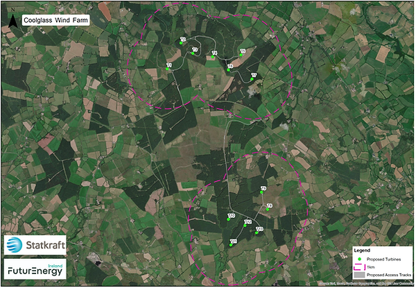
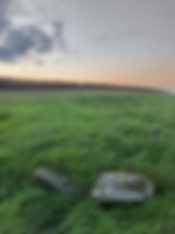

In the past few years, we as a community have come together to protect our sacred and ancient lands from destruction, like when a proposal to put a motorway through the Boyne Valley, or when ABO wanted to put a windfarm in the hills around Balltinglass and Kiltegan, or when Dawn Meats proposed to construct a wastewater treatment plant on the shores of the Boyne river.

Now another windfarm is proposed for the Swan, Wolfhill, Timahoe, Luggacurren and Coolglass rural areas of county Laois.

Update!!
--------

We are delighted to announce that the Coolglass windfarm project has been refused planning  permission by An Bord Pleannala, with 'matters raised relating to archaeology and cultural heritage', being one of the many and significant reasons for its refusal.

This is a huge relief to the local communities affected.

Heartfelt gratitude for all the support, prayers and love.

The prayer continues to protect our sacred lands.

Coolglass Windfarm Limited have applied to An Bord Pleanala to construct 13 180 metre high wind turbines in Timahoe. This is an area that was previously 'red zoned', excluding it from proposed wind farms, according to [www.laoistoday.ie](http://www.laoistoday.ie/), on 15/9/23.

Following consultations pursuant to Section 182E of the Planning & Development Act 2000 (as amended), An Bord Pleanála determined that the proposed development is Strategic Infrastructure Development within the meaning of Section 182A of the Act which necessitates a planning application being made directly to An Bord Pleanála.

That means that Laois County Council will have not have the final say over whether this project proceeds or not.

Furthermore, the proposed site of the wind farm near the L3581 Knocklead road, is in an area that was not zoned for a wind farm under the Laois County Development Plan.

Independent Cllr Aisling Moran said: “There is not supposed to be wind turbines in that area. I am 100% for wind turbines and renewable energy but they have to be put in the right place.They are also supposed to be located 1.6km away from houses but I know they will be closer.“Wind turbines of that size are meant for the sea also as the flicker from them is huge.”

Fianna Fail’s Padraig Fleming said: “This goes against the County Development Plan. This area is simply not zoned for a wind farm and the application should be rejected.”

Fianna Fail’s Paschal McEvoy, a native of Timahoe, said: “An Bord Pleanala must be told that this area is in the exclusion zone.

Sinn Fein’s Aidan Mullins said that the fact the developers went straight to An Bord Pleanala suggests they ‘believe they can override the County Development Plan’.

Cathaoirleach Ben Brennan said: “It is simply ridiculous for us to sit and spend time doing a County Development Plan if another body can come in and disregard it. It would be a farce. Why should we bother in future if this happens?”

Submissions/observations must be made to An Bord Pleanála by 5.30pm on October 9.

That was the date given at the meeting on Wednesday but the date on the planning notice at the site says the deadline is October 6.

A standalone website containing all the particulars can be viewed at the following link [www.coolglasswindfarmsid.ie](https://coolglasswindfarmsid.ie/) –

The application is also on view at the Planning Office Laois County Council.

Tucked into the land between below proposed turbine site labelled T7, just within the pink line boundary lies the ancient megalithic site of Monamanry.

This megalithic structure at Monamanry, 'Móin na Manraí' – 'the bog(land) of the enclosure, paddock / bog of the mangers' (LA025-013) stands on top of a small hill, on elevated arable land and is marked on the OS map and the Historic maps as 'Druids’' Altar', 6 km west of the town of Ballylynan – 'Baile Uí Laigheanáin' – 'the town of Ó Laigheanáin (Lynan)'.

It is a circular mound 9m to 10m in diameter and 0.75m in maximum height. A kerb of small stones survives around almost all of the circumference but are somewhat concealed in the ground at the west. Two set stones, about 1m inside the kerb in the NE quadrant, indicate an inner kerb and there is a hollow measuring 3.50m in length and 2m in width at the centre of the mound where a slab, aligned NW-SE, 1.2m in length and 0.80m in width, lying slightly elevated above the ground which may be the roof of a tomb. The megalithic tomb of Manger (LA025-018) is 2kms to the East.

In their book, 'History of Queen's County', O'Hanlon & O'Leary give a brief mention of the Monamanry structure.

They wrote that 'in the town-land of Monamanry and parish of Tullomoy, about a mile and a-quarter west from the Ass's Manger, there is a Dolmen marked Druids' Altar on the Ordnance Survey Town-land Map' (O'Hanlon & O'Leary, vol.1, p. 56). Borlase in his excellent 'The Dolmens of Ireland, Vol. 2', also gives a very brief mention of Monamanry. He wrote that 'in the Townland of Monamanry, and Parish of Tullomoy, a mile and a quarter W. of the Ass's Manger, is a dolmen marked Druids' Altar in Ord. Surv. Map No. 25' (Borlase, W., vol. 2 p.374).

Descriptive remarks from the Ordnance Survey Parish Namebook dated 1838 stated that '…there is a druid's altar in the east portion, ancient druid's place of worship.

Information from Mega Phils, MyMegaMonument No.48.

Personal  
Stories
------------------
