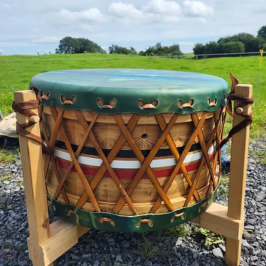
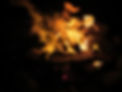
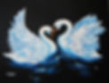
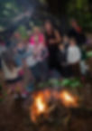
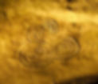
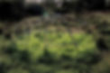
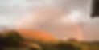
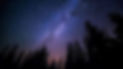
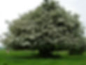
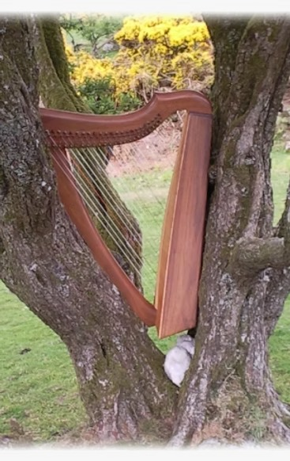

Upholding the Ancient Spiritual Traditions of Ireland

The Temple of Éiriú is recognised by the Irish State as a spiritual community. It is the Irish branch of an international collective that honours the old indigenous ways of the Earth and seeks to bring that wisdom forward to help us to navigate in these modern times. Its foundation is a blend of the old Celtic ways and the medicine path of the First Peoples of the Americas.

We hold a vision that all the peoples of the Earth will come together in this time, each with their own unique understandings, to create a healthy and sustainable way forward for ourselves, our children and the Earth herself.

We respect and support all traditions that hold the intention that all life is sacred.

​

The intent and vision of the Temple of Éiriú is;

*   To reclaim the Ancient lineage of the God and Goddess on the Land for the peoples.
    
*   To enable the restoration of the Sacred relationship between the people and the Land.
    
*   To recognise, hold and guard all life as Sacred on the Land.
    
*   To protect the sanctity of the children.
    
*   To hold and promote the equality of all peoples on the Land and respect all spiritual traditions on the Land.
    
*   To provide such spiritual, educational and public activities to provide for the spiritual welfare of members and the peoples.
    

​

Our Core Beliefs

​

The Creative Force, which can be called by many names, embodies female and male and is beyond both, is manifest and unmanifest, the immanent essence of all life, embraces Earth and Sky, and is the all and the everything.

All life is sacred, interconnected and interdependent within the web of existence.  
Grandmother Earth and her worlds (mineral, plant, animal, human and ancestral) are sacred, equal, and treasured jewels.

The Temple holds as sacred that nothing shall be done to harm any child of any world of Grandmother Earth, all life is born of woman, and within the interconnected web love is the only reality.

Female and male and all members of every race are fundamentally equal, such equality being evident and embodied in our actions.

The soul is eternal, ever learning and expanding; each of us choose, manifest and navigate our own destiny.

The primary alignment of the Temple is to the Goddess Brigid and the Ancient Holy Ones of Éire. We equally embrace the wisdom of teachers/prophets including Christ, Mother Mary, the Buddha, Sri Mata Amritanandamayi Devi (Amma) and other such teachers whose teachings are supportive of/congruent with our own belief system.

The Temple respects the presence of all other religious/spiritual traditions on the island of Éire and their right to their own unique beliefs.

## Upcoming Events

*    

[Weaving 2025](https://templeofeiriu.github.io/event-info/weaving-imbolc-2025)

Ceremonies
----------

Ceremony is a time of celebration, connecting to the ancient wisdom and magic of the land, and remembering our deep connection with the natural world.

The Temple of Éiriú offers ceremonies in restoration of the Sacred relationship between the people and the Land

​

[To see our full range of life ceremonies, workshops and events please click here](https://templeofeiriu.github.io/life-ceremonies)

### The Perfect Wedding

If you love Ireland, her natural world, and myths and stories, then you will love a wedding officiated by Temple Of Éiriú.

​

As our main focus is engaging with the spirit of Ireland and the natural world, there is no one better to marry you and  bring the magic of Ireland to one of the most special days in your life.

​

[Please click here to find out more](https://templeofeiriu.github.io/weddings-1)

[Get in Touch](https://templeofeiriu.github.io/weddings-1)

### Fire Festivals

Fire is what holds people together in community and heart. Fire is a place to come together for warmth and connection, not only the physical level, but also emotionally, mentally and spiritually. We gather in community around the sacred fire, and as we hold our intentions for ourselves and others, we can find our stresses and difficulties transformed.

​

[For more information on our Fire Festival Gatherings please click here](https://templeofeiriu.github.io/fire-festivals)

[Get in Touch](https://templeofeiriu.github.io/)

### Aisling Eala - Swan Dance

The vision of Aisling Éala is to awaken and gather the wisdom that has been left by our ancestors encoded in our stories and in the spirit of the land itself, our beautiful Éiriú. This wisdom can help us navigate the transition time we are now passing through on the earth and guide us to a finer vibrational energy.

​

[Please click here for more information on the Aisling Eala](https://templeofeiriu.github.io/aisling-eala)

[Get in Touch](https://templeofeiriu.github.io/)

### Baby Naming Ceremonies

Here the child is welcomed into life by the family and community. The child is blessed into the elements of fire, earth, water, air and ether to help to anchor them in this life and to bring protection and blessing. It is encouraged that the community bring their best intentions for the child, that will help them grow in strength and love.

[Get in Touch](https://templeofeiriu.github.io/)

### Funerals and Life Honouring Ceremonies

We offer beautiful and personal ceremonies to honour loved ones who have passed. We hold prayers and blessing for their passing from this life in peace, and celebrate and remember the jewels of their life. Ceremonies can be tailored to the wishes of people and their families.

[Get in Touch](https://templeofeiriu.github.io/)

### Home Cleansing & Blessing

This service is offered so that your home can truly become a place of sanctuary, where you can rest and rejuvenate. We can clean our houses physically, but there is also the need to cleanse them of old emotions, thought patterns and stagnant energies. After the cleansing, we bring in a blessing for the hearth and home that is in harmony with the residents.

[Get in Touch](https://templeofeiriu.github.io/)

### Sweat Lodge Ceremonies

The Sweat Lodge ceremony has been performed by indigenous peoples around the world from ancient times up to the present and is a simple and powerful antidote to the mind maze of our modern Western culture. It purifies, restores and opens to our heart bonding with life, to experience our lives as a gift and a blessing. The ceremony clarifies our path in life and strengthens us to take the steps we need to celebrate our lives and bring them into balance.

We also advise communities interested in building their own Sweat Lodge.

For more information on upcoming Sweat Lodges please get in touch

[Get in Touch](https://templeofeiriu.github.io/)

### Every Day Goddess

The focus of this course is for creative communication between the sexual and the spiritual parts of ourselves so we can sit comfortably in our lives, claiming our self authority as Woman.

​

[For more information on this workshop and others please click here](https://templeofeiriu.github.io/workshops)

Get in Touch

### Weavers of the Grail

On this course you will deepen in service to the divine feminine and learn:

To connect with your sisters in a circle to weave blessings and beauty

To connect in ceremony with the natural world

To feel and sense these energies in your body

About focus and intent for ceremony

Where your strengths and challenges lie

How to introduce yourself to a sacred site

​

[To learn more about this and other workshops please click here](https://templeofeiriu.github.io/workshops)

Get in Touch

### Vision Quests

We offer the opportunity for Vision Quests at certain times of the year.

Get in Touch

### Other workshops and ceremonies

The Temple of Éiriú holds events and ceremonies throughout the year that hold the intention of connecting us to the rhythm of Grandmother Earth, bringing us back into balance, and as an offering to Éiriú, Grandmother Earth and all of her worlds.

​

[You can find more information on all of our workshops here.](https://templeofeiriu.github.io/workshops)

​
If you would like further information on these or to be kept informed of upcoming events please contact us @
[templeeiriu@gmail.com](mailto:templeeiriu@gmail.com)

