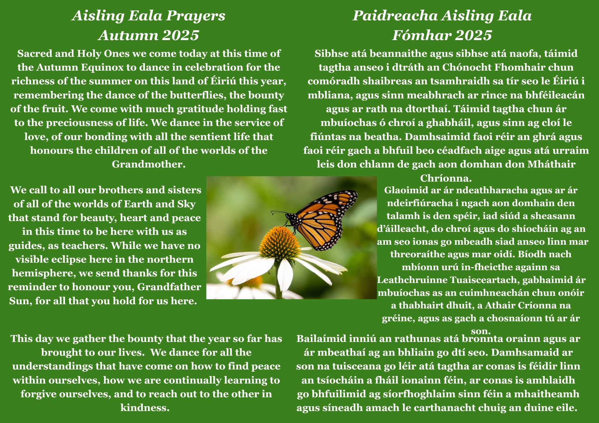
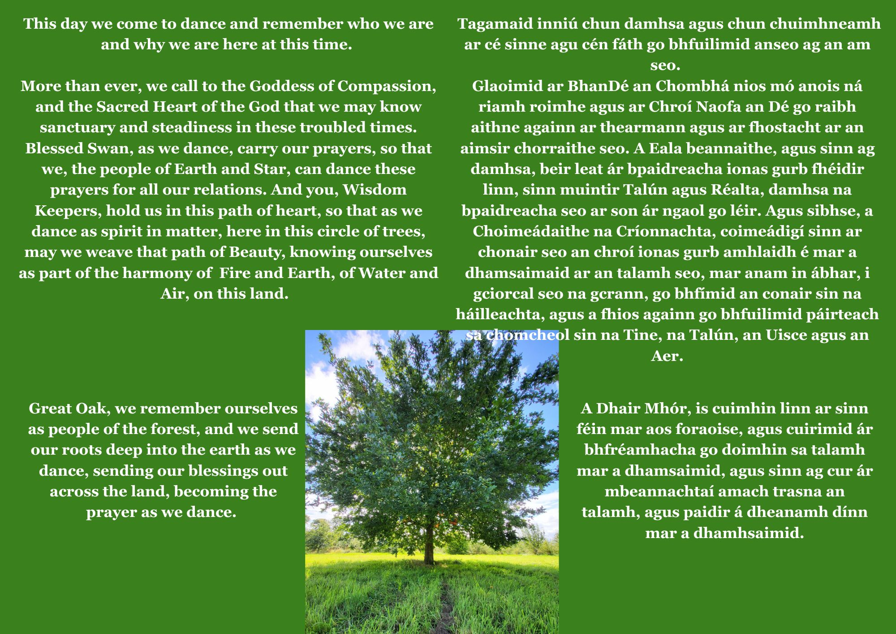
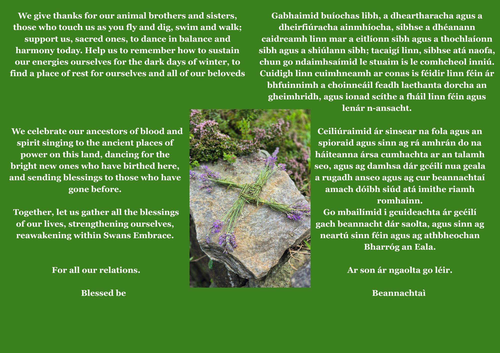

### Autumn Aisling Eala 2025.

### ​

Aisling Eala Swan Dance
-----------------------

The Vision of Aisling Eala

The vision of Aisling Éala is to awaken and gather the wisdom that has been left by our ancestors encoded in our stories and in the spirit of the land itself, our beautiful Éiriú. This wisdom can help us navigate the transition time we are now passing through on the earth and guide us to a finer vibrational energy.

​

This is a two-day shamanic ceremonial dance at the Spring and Autumn Equinox, to reconnect with the enlightened energy of the Swan, the holder of sovereignty and ancestral memory in our mythos.

​

The next Aisling Eala will be held on Saturday 21st and Sunday 22nd March 2026 for our 17th Swan Dance.

​

Invitation to Shamanic Dance Ceremony

​

We come together at this Vernal Spring Equinox window, the time when light and dark are in perfect balance, to dance our prayers and our hearts dreaming into the Great Mystery of Life. Welcoming all who feel called to dance and connect to Grandmother Earth, to bless and feel her soft grass beneath bare feet, to participate in this ceremony that is both ancient and new, as the wheel of the year turns and we feel the rising energy of the Age of Aquarius and the coming of the Chinese year of the Fire Horse.

We open to the healing medicine of Swan during this ceremony, the holder of soverignity and ancestral memory in our mythos.

This outdoor ceremony begins with us greeting and experiencing the blessings of the first rays of Grandfather Sun, rising over the Wicklow mountains. The axis mundi of our dance is a sacred oak, around which we dance our prayers awake. Each dancer is invited to dance the prayers of their hearts for Éiriú and beyond.

​

Saturday 21st and Sunday 22nd March 2026:

2 Day Shamanic Ceremonial Dance to reconnect with the enlightened energy of the Swan, the holder of sovereignty and ancestral memory in our mythos. We come together, at this time of the Autumn Equinox, this time of balance to dance our prayers and our hearts dreaming into the great mystery of life.

We will dance outdoors for the day, our moving prayer circle centred around a sacred oak tree. Participants can dance the prayers of their own heart, for Éiriú, and beyond.  Please see the more detailed prayers to follow.

No previous experience is necessary, but some advance preparation is required so booking is essential.

Saturday 21st March : Checking in, deepening into the Land and preparation of the Ceremonial Space, followed by a cleansing Sweat Lodge ceremony, finishing off the day with a Drum and Chant practice.

​

Sunday 22nd March: Aisling Eala Ceremonial Swan Dance

Dance chiefs: Trish Cameron & Hilary Healy

Date:  Saturday 21st and 22nd of March 2026

Venue: Kiltegan, West Wicklow, Ireland

Suggested Donation: €100

Returning Attendees: €65

Team Leader Concessions and other Concessions available, please contact us. [templeeiriu@gmail.com](mailto://templeeiriu@gmail.com)

Link for Donation: [https://www.paypal.com/paypalme/templeofeiriu](http://www.paypal.me/templeofeiriu)

Bookings/ Enquiries contact: [aislingeala@gmail.com](mailto:aislingeala@gmail.com)

Aisling Eala Prayers  
Spring 2026 Prayers to follow.
----------------------------------

Swan stories from our mythology
-------------------------------

Ireland is a land rich in stories, many of which are the remnants of an oral tradition handed down from generation to generation. At some point, usually in the later Christian times, they were written down with the cultural and religious filter of the time.

​

The Children of Lir is one of those stories; a story of beauty, mystery and loss.

​

​The Aisling Eala ceremony is offered with the intention of acknowledging and transmuting the grief and suffering in the Children of Lir and reclaiming the more ancient understanding of swans as creatures of enlightenment bringing hope and opportunity, of stepping through our recent past and bringing about a brighter future for the generations to come. Like the swan, we can bring a finer energy into this third dimensional reality so tha\t all may benefit.

The Children of Lir
-------------------

Most in Ireland knows the’ legend’ as it is taught in the schools. It tells the story of 4 children who are turned into swans by their jealous step mother and endure 900 years in exile from their people. Versions of the story vary but essentially they keep their singing voices and so are still able to express themselves and this is a great blessing for the people who come to listen to them. When the curse is finally over, they come home but the land has changed, their kin people are gone. They find a monk who looks after them and baptises them into Christianity at which they transform back from swan into very old people, die and go to heaven. There are many slightly different versions available online.

As already mentioned, this swan story was first written down by Christian monks and so it has a distinctly Christian slant. Arising out of the oral tradition prior to these stories being written , swans would have been invariably viewed as sacred birds.The Aisling Eala ceremony is offered with the intention of acknowledging and transmuting the grief and suffering in the Children of Lir and reclaiming the more ancient understanding of swans as creatures of enlightenment bringing hope and opportunity, of stepping through our recent past and bringing about a brighter future for the generations to come. Like the swan, we can bring a finer energy into this third dimensional reality so that all may benefit.

Swan in Ancient Indigenous Cultures
-----------------------------------

In India, the swan , or hamsa, is often identified with the supreme spirit. The flight of the hamsa symbolises release from the cycle of samsara, of birth and death. Saraswati, the Hindu goddess of knowledge, music, arts and nature,rides the swan which embodies this pure knowledge. She is a part of a trinity with Lakshmi and Parvati. All the three forms help the trinity of Brahma, Vishnu and Shiva in the creation, maintenance and destruction of the universe.. Yogananda, one of the yogis who popularised meditation in the West was known as Paramahamsa (Supreme Swan) because of his spiritual level of attainment.

Swans were also known as soul birds in many early cultures. They took the souls of those who have died back to source and were also associated with bringing the incarnating souls back from source into this life. Andrew Collins in his work on the star constellation of Cygnus sees this star system as the one that ancients understood as the source of life and to where all souls return. Cygnus is positioned in the Milky Way where it splits into two forming what is known as the dark rift. Collins has written extensively on his views that many ancient sacred sites are aligned northward to Cygnus.  
His theories on Kobekli Tempe in Turkey, Giza pyramids and Avebury in England can be found online. Murphy, here in Ireland, has researched how the Cygnus constellation aligns with the Boyne Valley complex as far as Four Knocks at Naul and how when NewGrange was built that it would have been Deneb, the brightest star in Cygnus constellation that would have heralded the rising of the sun on the winter solstice. And indeed, whooper swans still over winter at New Grange every year.

[See Anthony Murphy and The Cygnus Enigma](https://www.youtube.com/watch?v=Ubif9jLPxuY)

Other stories regarding Swans in Irish Mythology
------------------------------------------------

Swans in Ireland have always been seen as embodiments of beauty and mystery, shape shifters moving in and out of the other realms, transcendent, otherworldly, yet very present in this world , which is why they are a perfect embodiment for us to experience the divine within the material. The poet Yeats captures this otherworldliness and physical presence beautifully in his poem ‘ Wild Swans at Coole:  
"[https://www.poetryfoundation.org/poems/43288/the-wild-swans-at-coole](https://www.poetryfoundation.org/poems/43288/the-wild-swans-at-coole)"There are many other stories regarding swans in Irish mythology.

Two of the more famous are ‘Aonghus and Caer’ and ‘The Wooing of Etain’.  
These two stories also demonstrate the bringing of the refined vibration of love into physical manifestation. The story of ‘Aonghus and Caer’, what is dreamed about is made real and in the case of the ‘Wooing of Etain’, the remembrance of who we are and of a love that prevails through lifetimes.

​

Aonghus is the god of love and he lives at Bru Na Boinne. Every night he dreams of this beautiful woman but each time he tries to touch her, she vanishes and he wakes up. He becomes love sick and after a long search to find her, he eventually locates her over in the west of the country. He finds her in the shape of a swan on a lake because she shape shifts from woman to swan throughout the year. Even though she is in swan shape, he recognises her out of a group of over 150 swans . Out of love for her, he himself, becomes a swan and they fly back together to NewGrange where they live.The full story is available on the internet.

This telling can be simply enjoyed as the beautiful love story that it is. It can also be experienced on other levels. Love transforms us, refines us, in the way that Aonghus allows himself to become swan in order to be with Caer. For ourselves also, we may have to face certain challenges or choices that ask much of us in order to put flesh and bones on our hopes and dreams. As T.S Eliot says at the end of ‘The Four Quartets’ ‘A condition of complete simplicity, (Costing not less than everything)’. So Aonghus surrenders his human form so strong is his desire to be with Caer.

Sacred Marriage
---------------

A recurrent theme in Irish spirituality is the Sacred Marriage; the male and female principles coming together to regenerate the land and the people.This understanding is also prominent in Egyptian mysteries in the union of Isis and Osiris giving birth to Horus. Horus is the new dream, the light to lead the people forward. We see this in Christian mythology in the birth of Jesus as the light of the people and a new way forward. This outer marriage is mirrored in the quest for the opposite polarity within to bring personal inner balance. This is close to what is understood in Jungian psychology as the search for the anima and animus.  
We find this inner beloved, then we are regenerated ourselves and open the path to our soul so it may fly free and bring into being our own rebirth. In this story, this freedom is symbolised by the swan.

In the story, the Wooing of Etain, we are taken on a journey that tracks Etain’s soul love for Midir over life times, from its beginnings in the expanded and refined realm of the Sidhe, through her forgetting of this love in the earthly domain to her remembering it once more when Midir comes to the earthly plane and their return together to Sidhe world.This story is extremely elegant and beautiful in its depth and complexity and here we follow one main thread only. Etain after much prompting by Midir finally remembers who she is and the great and abiding love she has for him. In many ways, this is very like our own journey on this earthly realm. We get very involved and forget we are souls here on a journey. Time after time, our souls try to speak to us in dreams, sometimes in quiet moments and sometimes not so quietly until eventually we might listen and understand ourselves as more than the reality that our physical eyes observe. In departing from the story as it has been given and to reform it into a story for these times that we live in. Is it not time to remember ourselves, our purpose from spirit in being present here on the earth and bridge this expanded remembrance into a third dimensional reality to create a compassionate society made up of humans who care for life and are willing to serve for the good of all?

Given these two wonderful stories, why has the Lir story of swans been the most popular one? Why has the sad, tragic story gained popularity over the other ‘successful’ swan stories?

One answer is that over the last hundreds of years, with colonization, dispossession and famine, the Irish have lost their identity, part of their soul, their indomitable spirit; a proud , passionate and soulful people laid low and subservient. The collective spirit has become attached to what is sorrowful and full of loss, just like the Lir story. The swan, as a symbol of soul, is what has been thought exiled and lost; of the part of the soul that couldn’t survive well through the changing times as human history moved forward. It is time to transmute now what remains of this grief , bring the swan home, not so it can go off to heaven somewhere else but to live here, bring heaven to earth again. While not forgetting our past, we can lift our hearts and spirit to hope again, gather strength for ourselves, create a confident and compassionate way forward. The swans return with a message of hope for the people , wisdom gained after all their challenges; they return to show a new way forward. This is the Lir story that is offered to you. It is not without its challenges but not without offering hope and a way of remembering who we are as a people and empowered creating a new story for ourselves. The swans have been holding the parts of our soul that we have forgotten and now bring them back to us. To once more embrace all that we are.

Contact
-------

To find out more information about weddings, ceremonies or teachings at Temple of Éiriú - Celtic Traditions, or if you would like to become a member, and receive our newsletter, please contact us today. [templeeiriu@gmail.com](mailto://templeeiriu@gmail.com)  or [via online form](/contact-us)
