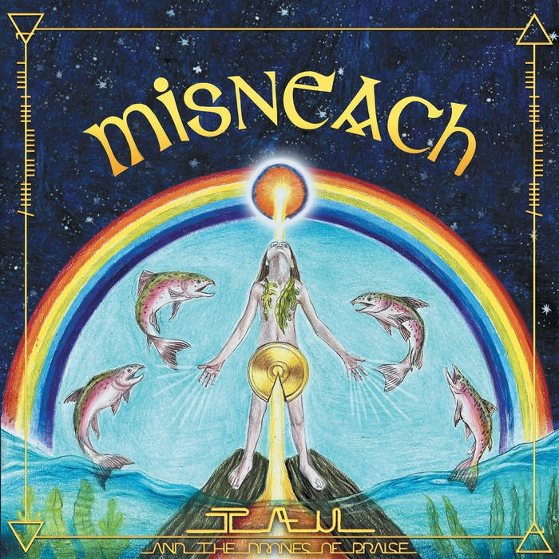

No Two Sides
------------

​Seán Mulrooney's new song No Two Sides had its worldwide release on December 15th.  
All profits go to PCRF, Palestine Childrens Relief Fund

‘No Two Sides’ is a clarion call for compassion and peace. It is a reminder of our collective humanity and a deliberate naming of that which so many are failing to name; genocide. It is a protest song that centres the children and serves to inspire the powerful movement for Palestine and world peace that is mobilising voraciously across the world.

### Lyrics

There can be no justification for this occupation  
This is not a war. This is genocide  
There can be no justification for the murder of children  
This is a sacred law.  
Do nothing to harm the children.  
Without compassion there's only reaction  
As profits is arms soar. If you follow the money you'll see who calls for war  
There are no two sides to genocide  
There are no two sides to genocide  
Well Nelson Mandela was a heck of a fella  
As he led with love  
And he broke down the apartheid  
Well Mahatma Gandhi took on the royalty  
And through peaceful means,  
He became fucking unstoppable  
There are no two sides to genocide  
There are no two sides to genocide  
Do nothing to harm the children  
Do nothing to harm the children  
Well a life of prayer would not be a wasted life  
But actions speak louder than words  
And its time for action.  
Even with the violence, we will not be silenced  
Let our love will be greater than fear.  
There are no two sides to genocide  
There are no two sides to genocide  
Do nothing to harm the children  
Do nothing to harm the children  
There are no two sides to genocide  
This is a sacred law  
Do nothing to harm the children  
Do nothing to harm the children

credits

released December 15, 2023  
Seán Mulrooney - Guitar & lead vocal  
Steffan Murphy - Guitar & backing vocals  
Laura Oneill - Percussion & backing vocals  
James Smith - Bass, piano & backing vocals  
Dave Thomas - DrumsProduced by Seán Mulrooney & James Smith  
Engineered by James Smith at Hellfire Studios, Dublin  
Mastered by Ivan Jackman

'Even with the violence, we will no be silenced. Our love is greater than fear'  
[https://seanmulrooney.bandcamp.com/track/no-two-sides](https://i-m.us7.list-manage.com/track/click?u=595dd0ef2732ce0467c9cdb30&id=69064c1352&e=5d46086749)  
All proceeds raised will go to Palestine Children's Relief Fund.  
By buying this single you are helping children in Palestine, you are calling for an end to the genocide and you are also helping Seán achieve his goal of Christmas no 2.  
<!--https://music.apple.com/.../no-two-sides-single/1720650923 -->
[no two sides apple music](https://i-m.us7.list-manage.com/track/click?u=595dd0ef2732ce0467c9cdb30&id=81612ab2a6&e=5d46086749)  
In this phenomenal time we are in, anything is possible!  
Artwork [Dee Mulrooney](https://i-m.us7.list-manage.com/track/click?u=595dd0ef2732ce0467c9cdb30&id=d1f7e9c098&e=5d46086749)  
Featuring [Stefan Murphy](https://i-m.us7.list-manage.com/track/click?u=595dd0ef2732ce0467c9cdb30&id=54d4ed031a&e=5d46086749) [Dan Bracken](https://i-m.us7.list-manage.com/track/click?u=595dd0ef2732ce0467c9cdb30&id=e203efc04f&e=5d46086749) [Ellowen](https://i-m.us7.list-manage.com/track/click?u=595dd0ef2732ce0467c9cdb30&id=e9659057b0&e=5d46086749)[James Smith](https://i-m.us7.list-manage.com/track/click?u=595dd0ef2732ce0467c9cdb30&id=8cae6c7d2b&e=5d46086749) & Dave Thomas.

Ceol Ón Chré
------------

"Ceol Ón Chré" is the second focus track from the album Misneach from the Berlin meets Ireland collective Tau & The Drones of Praise.

This remarkable collaboration features contributions from acclaimed Irish singer-songwriter Damien Dempsey and Pól Brennan of the legendary Irish group Clannad (they also appear in the video). The track is marked by both traditional folk textures and experimental atmospherics. The video was shot on Sliabh An Iariann (The Iron Mountain) in County Leitrim, Ireland. It is a contemporary ode to the story of the Tuá De Dannan, the pre-Christian deities who are said to have landed in a cloud of smoke on that very mountain. Tau & The Drones of Praise leader Seán Mulrooney says this about the track: “I was encapsulated by the song and the vibrations that it imbues. It is a great honour to join with two brothers in arms to bring this song to the world. It is a song for children. It is for generations to come and for the people of today and tomorrow to have the misneach (courage) to move forward with neart (strength), imbas (wisdom), grá (love) and cumhacht (power).”

Pól Brennan, who wrote the song as an oral chant, says: “This song was a gift from the Sacred Drum. First came the drum beat, followed by the melody and words. It was offered and sung for the first time at an Eagle Dance Ceremony in Wicklow.”    Damien Dempsey adds; “There is something primal in our ancient mythology that stirs the heart in a way that ordinary words can’t explain. We can hear it in our music, poetry and drums. We can hear it in the land. We can hear it in this song.”

Ceol ón Chré has travelled the world over and was recently featured on The Mother Earth Delegation of United Original Nations" Webinar where you can hear the wisdom shared by a delegation of elders who come with directions from Mother Earth to help us walk through these times of great chaos and change. Grandmother Luisah Teish (Lyanifa and Oshun Chief), Grandmother Loretta Afraid of Bear Cook (Oglala Sioux Nation, Turtle Island) Universal Mother (Bwiti Grandmothers from Gabon, Africa) Grandmother Jyoti Ma (Elder, USA) Grandfather Randy Lays Bad (Oglala Sioux, USA), Shawna Bluestar Newcomb (Shawnee, Lenape, Turtle Island) Kurikindi (Kichua, Ecuador)

[https://www.youtube.com/live/HTEMINY7Iq8?feature=share](https://www.youtube.com/live/HTEMINY7Iq8?feature=share)

Tau & the Drones of Praise - 'Misneach''Misneach' is the kaleidoscopic third album from Seán Mulrooney and his Ireland meets Berlin ensemble. Recorded mostly in Berlin at Impression Studios by Robbie Moore, who also plays in the main four-piece studio lineup with Mulrooney, Earl Harvin (Tindersticks) and Iain Faulkner (who helmed additional recording in Dublin at Sonic Studios), the album also features Pól Brennan from Clannad and Irish troubadour Damien Dempsey. 'Misneach' is an album of ecstatic folk-psych that fully embraces the natural world and living ancestry, through joyful experimentation and deeply rooted sonics. An inspired soundscape that echoes eclectic and eccentric atmospheres: traditional Irish folk, outsider pop, global sacred music and drone rock.

"For Misneach, Tau and the Drones of Praise started with minimalist drones, but ended up creating expansive folk pop spirituals for the modern age ... Misneach is a robust Irish word, describing courage, spirit, bravery and fortitude, qualities that are in abundance on this captivating record ... a psychedelic Irish folk record with a huge heart and even bigger soul." \*\*\*\* The Irish Times.

​

​Tau & the Drones of Praise - 'Misneach'  
New album out now on Glitterbeat  
LP (GBLP 129)/CD (GBCD 129)/Download/Streaming  
<!-- Order on Bandcamp: [https://tauandthedronesofpraise.bandcamp.com/album/misneach](https://click.icptrack.com/icp/relay.php?r=26723910&msgid=2105010&act=QRK7&c=993244&pid=3137642&destination=https%3A%2F%2Ftauandthedronesofpraise.bandcamp.com%2Falbum%2Fmisneach&cf=16575&v=773db1a4b07fbf61297a814c57f3a901aedb9daad851eb274d39ac83ae54c69c) -->

