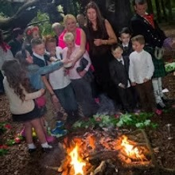
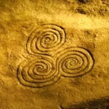
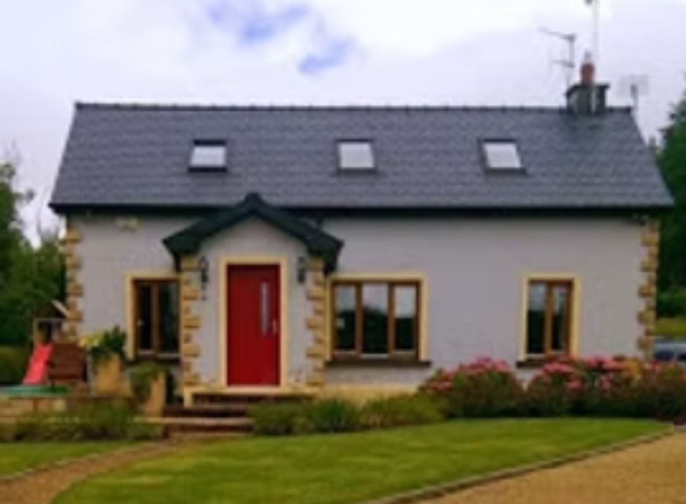

To honour and mark the passage of time ,ceremonies for major life transitions are available. These can take many forms and can be for any time in life that has a major impact on you, for example: relationship separation, becoming a parent, major birthdays or anniversaries, rites of passages into adulthood for young women and men.

Baby Naming Ceremony
--------------------

Here the child is welcomed into life by the family and community. The child is blessed into the elements of fire, earth, water, air and ether to help to anchor them in this life and to bring protection and blessing. It is encouraged that the community bring their best intentions for the child, that will help them grow in strength and love. [Please contact us for more information](https://templeofeiriu.github.io/)

Funerals and Life Honouring Ceremonies
--------------------------------------

We offer beautiful and personal ceremonies to honour loved ones who have passed. We hold prayers and blessing for their passing from this life in peace, and celebrate and remember the jewels of their life. Ceremonies can be tailored to the wishes of people and their families. [Please contact us for more information](https://templeofeiriu.github.io/)

Home Cleansing & Blessing
-------------------------

This service is offered so that your home can truly become a place of sanctuary, where you can rest and rejuvenate. We can clean our houses physically, but there is also the need to cleanse them of old emotions, thought patterns and stagnant energies. After the cleansing, we bring in a blessing for the hearth and home that is in harmony with the residents. [Please contact us for more information](https://templeofeiriu.github.io/)

Contact
-------

To find out more information about weddings, ceremonies or teachings at Temple of Éiriú - Celtic Traditions, or if you would like to become a member, and receive our newsletter, please contact us today. @ [templeeiriu@gmail.com](mailto://templeeiriu@gmail.com)
