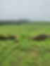

####                         Autumn Equinox Newsletter

Lughnasadgh Newsletter
----------------------

Summer Solstice Newsletter
--------------------------

Temple of Éiriu
---------------

Bealtaine Newsletter

2024.

​Welcoming Taurus Season and the peak of Spring, we prepare ourselves with excitement for the lighting of our Bealtaine fires. Personally I love this time of year, with Swallows gracing our skies in murmuration, the leafy green leaves blowing gently (mostly) in these winds of constant change and evolvement.  
The feeling of graceful quickening, vibrant colours, birdsong, blossoming flowers about to burst. Its a delicious feast for all the senses.  
With all that is going on in our world these days, the steadfastness of nature keeps me hopeful and grounded.

A white Buffalo has been born 25/4/24 in Kansas. For those who don't know the prophecy of the White Buffalo Woman, it is the most significant prophecy of the Lakota people, others like Comanche and Navajo also see it as a sign of things changing in the world and better times coming.  
Even the National Bison Association says that it is indeed a rare event, about 1 in ten million chance.   
A symbol of Hope, and honouring that which is sacred.  
'Nineteen generations ago the beautiful spirit we now refer to as White Buffalo Calf Woman brought the Sacred C’anupa (Sacred Pipe) to our People. She taught the People the Seven Sacred Rites and how to walk on Mother Earth in a sacred manner. Pte-san win-yan. As she left, she turned into a young beautiful white buffalo and then she walked over the hill and out of sight. This is where she received her name, White Buffalo Calf Woman. She gifted us with the Seven Sacred Rites that still sustain our People today.  
The person who smokes the sacred pipe achieves union with all Beings.

By smoking this C’anupa, you will make direct personal contact with the Great Mystery. . . Following the Way of this Sacred C’anupa, you will walk in a sacred way upon the earth, for the Earth is your grandmother and your mother and she is sacred. . .″

— Chief Arvol Looking Horse

### Upcoming Fires and Events 

Inviting you to be linked in to the Bealtaine Fire Ceremony with the Temple of Éiriú this Wednesday 1st May, from 7.30pm-9.30pm. At this time of great Hope and Promise, we celebrate the fertility of the earth and the inspiration and light of the sun. The quantum healing will be to support the sustainability of the divine aspect of both in co-creation of our own unique tree of life, as the standing people, the trees, and the plant kingdom do interconnectedly in communion with their environment. Let me know if you would like me to link you in energetically, the fair exchange is to pass on an act of gratitude.  
Kay/Diamond xxx

Firewalk  
Come join us for a night of dance, community and walking through the fire of growth and transformation.  
Saturday May 4th, 6.30pm  
Talamh Nua,  
Leana,  
County Clare

The ancient art practiced by many cultures throughout the world. It is an invitation to become one with this powerful element and connect to the land in a very unique way.  
With this walk we will feed our intentions, honour our ancestors and step through the fears of our lives.  
Through the fire we will birth and unleash the fullness of our expression into the world. We join to set our hearts ablaze in love, passion and compassion.  
Fire Walking Instructor: Albert Serino  
Hosted by Mike and Jay  
Date:  Saturday May 4th, Opening Prayers at 6.30pm

Please Contact Mike for further information  
0868965433

We are delighted to announce that the Bealtaine Fire Festival 2024 is when we will all meet again on this Sacred Landscape and join together to celebrate the coming of Summer on the Hill of Uisneach, here in the heart of Ireland.

Join us this May when together we will celebrate our amazing Irish heritage; through Music, Food, Mindfulness, Yoga, Crafting Demos, Stalls, Heritage Talks & Walks, Children’s Games, Unicorns Art on the Hill & amazing Fire Performers to list some of the many offerings on the day.

Together again we will watch the flames dance high as the sun sets on Bealtaine and Summer is welcomed back. . .

Join us again in 2024 on Saturday, 11th May from 16:30 – we are so  looking forward to welcoming you back to the Sacred Centre of Ireland

Children’s Tickets – SOLD OUT

Family Tickets – SOLD OUT

Adult Tickets – FEW REMAINING

Spring Equinox 2024

Newsletter

### As we land gently following our 13th Aisling Eala, I find myself wordless with gratitude for the beauty and the blessings of such an impeccably held ceremony.

Thank you to each and all that arrived with huge heart and joy to dance and pray with our ever growing community. Thanks to the Elements for an epic sunrise, and the gentle drops of rain that fell just as we finished, that stopped to allow us to return the land to beauty with grace and ease.  
Huge gratitude for our Dance Chiefs Trish LightningStar, and Hilary EarthDragún for their dreaming, holding and incredible gentle presence. To Mike our Fire Chief for holding such strong fires, to Seán FireBardMidnightSun and Kamilla SheWhoWalksWiththeHeartoftheLand for their holding of sponsorship so diligently, to our Dance Guardian George who despite been thrown in the deep end, helped everything go so swimmingly.  
Finally my epic Drum Team! We rocked!! You are all so beautiful, thank you for your time, energy and consistency, for bringing the wild warriors with so much heart.

Grá Mór agus Beannachtaí  
Ceoltóir Chroí an Darach  
Karen OakHeartSinger

.png)

This year’s Spring Equinox is at 3.06 am UTC, March 20th, a time of perfect balance between light and dark. It is a transition moment for our Earth and all her worlds when spring energy amps up in the Northern hemisphere and Autumn begins to change coat in the South.  
As the days lengthen in the northern hemisphere, this light fuels our creative energy as we emerge from the deeper dreaming time of winter, just as outside nesting and mating season gets into full swing. The reverse is happening in the Southern hemisphere where it’s time to celebrate the summer’s harvest, and to prepare for the transition into the slower pace of Autumn  
Shiva is said to have sat as an Ardhanari - half woman and half man at the equinox, because masculine and feminine are on an even keel on this day, according to Yogic tradition.   
On the days of the equinox —one in March and another in September—the celestial equator is in perfect alignment with the sun. The celestial equator is an imaginary line drawn above the earth’s equator, which divides the planet into northern and southern hemispheres. From this point, the magnetic field of the northern pole and southern pole alter in different ways and the influences upon the planet are at equilibrium.   
In line with the hermetic axiom As Above, So Below, it is understood that the significance of this day for humans is that the masculine and feminine are at an even keel—there is a level playing field within our own system.  
It’s worth noting here that masculine and feminine are not about being physically male or female. Certain qualities in nature have been identified as masculine, such as strength, logic, assertiveness, purpose, while other qualities have been identified as feminine, such as creativity, spiritual awareness, empathy, intuition, collaboration. When the sacred masculine and feminine happen in balance within a human being, it is understood that a life of fulfilment flows.  
In the yogic tradition, the equinox is the day when one has the best possibility of transcending the limitations of one’s physical longings, it also marks the beginning of the astrological year in Aries, hence a key window to get clear on our intent.   
Prejudice essentially arises in our minds because we are overly identified with something, so for example, if you are too identified with being masculine, you will have a masculine prejudice. If you are too identified with being feminine, you will have a feminine prejudice. The equinox is considered a day when one can be free of prejudice.   
According to Sadguru, “If you are conscious, just by feeling the way it is, you should know which time of the day, month, and year it is. That means you as a life are in perfect sync with the larger dimension of life. Modern physics is clearly telling you that everything pulsing within your body is in some way a reflection of the cosmic pulse. If this is just a small reflection of everything else, if you see clearly, you must see everything in the reflection.  
If you hold a mirror to the mountain you can see the mountain in the mirror.   
“It is just that the mirror should be clean, not uneven or covered with muck. You can see the world through your two eyes, which are so small. In the same way, you do not have to become a huge piece of life to reflect the cosmos within you. It is just about alignment. The equinox is the time to become unprejudiced, to not be identified with this or that, not even being a man or a woman, not even being human or another creature – just to sit and throb as life.”

Jay Carey

Equinox Fires to Link in With

Sending out an invite to a fire ceremony, at Talamh Nua, Leana, Killinaboy, Co. Clare celebrating the balance point of the equinox as we gather together in heart, pausing to align ourselves with the Earth's pulse and set our intent for the next round of the wheel of the year. Ceremony will commence at 7pm, Wednesday 20th March.   
For details contact Jay at 083 3353609Inviting you to be linked into the Spring Equinox Fire Ceremony from 7.30-9.00pm on Thursday 21st March with the Temple of Eiriu. At this time of balance of Night and Day, the focus will be on honouring,  harmonising and balancing the embodiment and dance of the sacred elements in all our aspects, and for the peoples, and all the worlds to sustain the way of Heart, Beauty, Grace, Peace and Freedom on Earth.  
If you would like to be linked in with your own candle or fire, let me know on 0868220980   
The energetic exchange is to pass on an act of kindness, Kay Diamond

​

Temple of Éiriú
---------------

Celtic Traditions

Imbolc Newsletter 2024

Spring is Springing
-------------------

Jay Carey
---------

Tomorrow February 1st, is celebrated as St. Brigid’s day in Ireland. It is the first Celtic fire festival of 2024, Imbolc derives from the Irish i bolg, in the belly, and in the fields and hedgerows birds are moving towards nesting and new life is being conceived.

I watched a fox slink across our neighbour’s field most likely hunting for a lamb yesterday. All I could do was marvel at the beauty of its red coat and hope the lambs were still in the belly, while accepting the divine design inherent in the interrelated web of life.

It was pitch black when I got up this morning, the deepest dark is always just before dawn, reminding me of how so very often things tend to get very bad, just before change for the better. It is through this lens that I am viewing the wars that are ongoing on the planet. Hence while I am gutted at the inhumanity of 5th generation weapons and insanity and heartbreak of Earth’s war zones, I am holding more strongly than ever that the absolute horror of our current war zones will be the catalyst for humanity to come together as a people and say No to War – Forever.

I do not believe the majority of humans want or are even capable of generating the levels of hate necessary to keep fuelling war, it is my understanding that it is our governments/military industrial complex/media and those behind them who are perpetuating this cycle.

And so tomorrow’s fire festival is a chance to add our energy to the many indigenous peoples who are in ceremony at this cross quarter point, as the first shoots of this year’s growth emerge and we sense Mother Earth’s energy rising.

Imbolc traditionally honours the potency of the Sacred Feminine and is celebrated as a national holiday - Saint Brigid’s Day in Ireland. And so we will be remembering Brigid in our homes tomorrow, Brigid the keeper of the perpetual flame. We will celebrate her passion, her healing skills, her miracles and draw her cloak of protection close around as we renew our Brigid’s crosses that serve as a protection for our hearth and homes.

The beginning of Spring is a time when our energy naturally looks inwards as we emerge from the deepest dreaming time of the year, it’s a time to listen to our intuition, our feminine side, and to sow the seeds of our dreams for the year ahead. We come into alignment with the energetic cycle of the wheel of the year as we walk the land outside, barefoot is best to deeply ground our beings, experiencing the potential of new beginnings already sprouting beneath our feet and the energy of the Sacred Feminine rising.

The indigenous cultures of South America say that humanity has been like a Condor flying with one wing for millennia. Our masculine side has been dominant and hence we forged ahead with progress regardless of the cost to the web of life, now however, we have moved into a time when the sacred feminine is rising. They say that when the Condor fledges with two wings, masculine and feminine in balance, within us all,  humanity will take the next leap of flight.

Ireland is named after the Goddess Éiriú and Ireland’s connection with the Sacred Feminine continued throughout our 800 year occupation, albeit much muted. Imbolc was first associated with the Goddess Brigid ‘Exalted One’ in the ancient cycles, She was the  Goddess of Healing, Poetry, Smithscraft, and Childbirth and daughter of the Dagda, Chief of the Gods of the Tuatha De Danann.

Many of her aspects were incorporated by Celtic Christianity into Saint Brigid, who founded a monastery in County Kildare in the 5th century, and is said to have performed numerous miracles including turning water into wine. The sisters who were followers of Saint Brigid tended a perpetual flame that she lit, and this perpetual flame is being tended today.

And so tomorrow we will light our Imbolc Fire on the land, we welcome the energy of the sacred feminine rising and hold for the restoration of balance and right relationship on this and all lands.

The sacred feminine is associated with the waters, the healing that happens as we allow our emotions to flow through us without attachment or judgment, surrendering to the flow of life as the waves ebb and flow with the tides, and a mother births her child.

Many holy wells in Ireland are named after Saint Brigid, and these holy wells continue to be tended to this day, especially on February 1st where the tradition of pilgrim walks to local wells continues.   When we kneel at the edge of a sacred well drawing from her clear waters, the beauty of the Goddess touches us and opens us to her beauty all around.

It is my prayer this Imbolc that we open to the energy of the sacred feminine rising all around us, as the grass starts to grow with the lengthening of each day, and buds begin to burst open, opening to our intuition, our creativity, our capacity to birth new life, new beginnings and nurture,  that humanity returns to right relationship between the sacred masculine and feminine within and without, so that we realise the dream our souls incarnated into these bodies and this life to fulfil, that we honour the sacred law that nothing is done to harm the children or the generations to come.

So much gratitude to all the wonderful souls that shared in last Saturdays Weaving Bridget, Drum Chant and Sweat Lodge, it was a beautiful day full of joy, powerful firey flowing energy to ready us for the Imbolc Emergence

NEW SONG ‘BRIGID OF THE FLAME’ LAUNCHES

\- RAINBOW STARLIGHT RELEASES A POWERFUL NEW SONG IN CELEBRATION OF ST BRIGID’S DAY

Sligo based singer-songwriter, Rainbow Starlight releases her second song, ‘Brigid of the Flame’,  
honouring the Saint and Goddess Brigid this week.  
This stunning arrangement takes us on a journey with Brigid, invoking a remembering of  Ireland’s ancient past, its’ myths and stories.  
Release Date: Imbolc, Thursday 1st February 2024  
Starlight brings her unique musicality and her deep connection to the land and Celtic stories, to craft this powerful piece.  
She says; “The spiritual connection of the Irish people to the nurturing energy  
of the Feminine has always endured. Through Mother Mary shrines across the land and the sacred holy wells of St. Brigid, it has always been present.”  
Starlight’s music has long been inspired by the multi- faceted spiritual traditions of Ireland.  
Following the success of her first single ‘Ón Mháithair’, collaborating with Clannad’s Pól Brennan and musician Seán Mulrooney in 2021, her latest composition is a joyful and soul-stirring melody crafted in celebration of the Saint and the Goddess Brigid of Ireland.  
Starlight says; “I wrote this song to honour Ireland’s new national holiday that is dedicated to one  
of our great heroines and modern icons. It is a celebration of the Brigid that we all know and love,  
the Goddess, the healer, the Saint, the seer, the keeper of the flame and the protector of the waters.  
“This song conveys the strength of the Divine Feminine and the compassion and love that Brigid  
had and still has for Her People” she adds.  
‘Brigid of the Flame’ was recorded in the centre of the Irish landscape in Co. Cavan and was shot on the majestic land of Co. Sligo, a place rich with history, myth and legend. The video and song work beautifully together to bring forth Brigid’s perpetual flame and the golden thread of the Feminine that runs through Ireland’s ancient past and present alike.  
‘Brigid of the Flame’ releases on Thursday 1st February at 11.11am and will be available online via Bandcamp, Spotify and in all main music distributer stores. The video premieres on YouTube at the same time 11:11am Thursday, 1st February and can be viewed here Rainbowstarlightmusic.

Media Enquiries:  
Helen Cantrell  
087 6997958, [email](mailto:Rainbowstarlightmusic@gmail.com)  
Bio: Rainbow Starlight is a singer-songwriter and a Song Carrier. Inspired and influenced by many different indigenous traditions across the globe she holds a large repertoire of sacred songs, chants and mantras. She held the post of lead ceremonial drummer for a number of sacred gatherings both in Ireland and Wales until 2023 and recently completed a 12 year spiritual and shamanic apprenticeship under the guidance of Arwyn Dreamwalker, a medicine woman and healer of Celtic and Native American Shamanic Traditions.

.jpeg)

Musician Seán Mulrooney will be performing some of his songs including his new releases on Saturday 3rd of Feb for Brigid 1500 showcase in Celbridge, Co. Kildare.  
"Seán Mulrooney is a musician /producer, song carrier and artist from Dublin with a career spanning 22 years, Band leader of Tau and the Drones of Praise and Musical accompanist with Edinburgh Fringe award winner Growler.

In response to the genocide we are witnessing in Palestine Seán released his first solo song 'No Two Sides' under his own name. Reaching No.7 in iTunes charts Christmas week. Seán will be playing music from his back catalog as well as new material and some sacred songs connected to Brigid, trees and the land.  
In Seán words 'Brigid is in charge of this one, I'm just stepping into her firey flow.'

This springs Aisling Eala will be a 2 day ceremony, with a community sweat lodge and preparation day on March 17th, with the Aisling Eala Dance on March 18th (Síle Na Gig day).  
If you are interested in being involved in the Drum Team, or preparation team please get in touch with OakHeart as we will be commencing practice sessions soon.  
Further information to follow.

### Imbolc Fires to Connect with

Inviting you to be linked into the Imbolc fire ceremony with the Temple of Éiriú on Wednesday, 31st January, 7.30-9.00pm.  
The intent of this healing ceremony is firstly, with the waters of Bridgid, to purify our emotions and thoughts. Then, her compassionate fire and light can fortify us in igniting,  manifesting, embodying, and maintaining our soul's longings from deep love in beauty. We do this for ourselves, all our relations, Gaia, and the children of all the worlds.  
The energy exchange is to pass on an act of kindness. If you would like to be linked in, let me know, Kay Diamond on 0868220980There will be an Imbolc Fire Ceremony at Talamh Nua, Leana, Kilinaboy, County Clare, commencing at 3pm on February 1st, all are welcome.   
We shall be visiting a local holy well beforehand, if you would like to join for the walk or the fire or both please contact Jay at O83 3353609.

Temple of Éiriú
---------------

Celtic Tradition

Winter Solstice

Newsletter

​The exact time of Solstice falls on Friday, December 22nd at 3.27am, but from the 19th up to the 23rd the light penetrates the darkness of the womb like Newgrange chamber. As we welcome and celebrate the return of Grandfather Sun after the longest night, we pay homage to the turning of the medicine wheel, and the triskel of birth, death and rebirth.  
It can be a time for reflection of ourselves, since the last solstice. What have we learned? What has brought joy? How many times has the words 'bliss' passed our lips?, What put that emotion there? Yes and more please.  
A personal highlight of the year for me was the Autumn Equinox Aisling Eala, and the ever expanding community of bright lights and big hearts, that worked with so much coherence, grace, and ease.  
I regularly find myself having to dip into that wellspring of abundant blessings to keep myself somewhat grounded with all that has happened in the world since.  
There has been a lot, in 6 weeks. Whirlwinds and tornados of meta-crisis after meta-crisis, overwhelming grief, anger, confusion, mirror worlds and loss, coupled with a feeling that

we are watching the old systems, old structures, and narratives crumble before our very eyes.

I ask myself what can I do?

I can write a letter, I can sign a petition, I can listen to or even buy a song, I can look in the mirror, as change is an inside job, I can drum, pray, chant and I can lift up our community.

With that in mind I would love to be able to promote you, in your medicine, and lift up your voice, on the Temple of Éiriú website, by creating a 'Building Community' page with links to your webpages if you have one, information of events that you are holding and contact information, as much or as little as you would like, co-creating a web of holistic hubs across the lands and beyond.

For more information email Karen OakHeartSinger by clicking the link below

Congratulations to our new  Apprentices who recently commenced their walks in Beauty with the Temple of Éiriú, we welcome Stephanie DreamMountainSinger,

Sarah LightningRose, and Sylvia HeartofFire.

### No Two Sides

Seán Mulrooney's new song No Two Sides had its worldwide release on December 15th.  
All profits go to PCRF, Palestine Childrens Relief Fund

‘No Two Sides’ is a clarion call for compassion and peace. It is a reminder of our collective humanity and a deliberate naming of that which so many are failing to name; genocide. It is a protest song that centres the children and serves to inspire the powerful movement for Palestine and world peace that is mobilising voraciously across the world.

### lyrics

There can be no justification for this occupation  
This is not a war. This is genocide  
There can be no justification for the murder of children  
This is a sacred law.  
Do nothing to harm the children.  
Without compassion there's only reaction  
As profits is arms soar. If you follow the money you'll see who calls for war  
There are no two sides to genocide  
There are no two sides to genocide  
Well Nelson Mandela was a heck of a fella  
As he led with love  
And he broke down the apartheid  
Well Mahatma Gandhi took on the royalty  
And through peaceful means,  
He became fucking unstoppable  
There are no two sides to genocide  
There are no two sides to genocide  
Do nothing to harm the children  
Do nothing to harm the children  
Well a life of prayer would not be a wasted life  
But actions speak louder than words  
And its time for action.  
Even with the violence, we will not be silenced  
Let our love will be greater than fear.  
There are no two sides to genocide  
There are no two sides to genocide  
Do nothing to harm the children  
Do nothing to harm the children  
There are no two sides to genocide  
This is a sacred law  
Do nothing to harm the children  
Do nothing to harm the children

### credits

released December 15, 2023  
Seán Mulrooney - Guitar & lead vocal  
Steffan Murphy - Guitar & backing vocals  
Laura Oneill - Percussion & backing vocals  
James Smith - Bass, piano & backing vocals  
Dave Thomas - Drums

Produced by Seán Mulrooney & James Smith  
Engineered by James Smith at Hellfire Studios, Dublin  
Mastered by Ivan Jackman

'Even with the violence, we will no be silenced. Our love is greater than fear'  
[https://seanmulrooney.bandcamp.com/track/no-two-sides](https://i-m.us7.list-manage.com/track/click?u=595dd0ef2732ce0467c9cdb30&id=69064c1352&e=5d46086749)  
All proceeds raised will go to Palestine Children's Relief Fund.  
By buying this single you are helping children in Palestine, you are calling for an end to the genocide and you are also helping Seán achieve his goal of Christmas no 2.  
<!--https://music.apple.com/.../no-two-sides-single/1720650923 -->
[no two sides apple music](https://i-m.us7.list-manage.com/track/click?u=595dd0ef2732ce0467c9cdb30&id=81612ab2a6&e=5d46086749)  
In this phenomenal time we are in, anything is possible!  
Artwork [Dee Mulrooney](https://i-m.us7.list-manage.com/track/click?u=595dd0ef2732ce0467c9cdb30&id=d1f7e9c098&e=5d46086749)  
Featuring [Stefan Murphy](https://i-m.us7.list-manage.com/track/click?u=595dd0ef2732ce0467c9cdb30&id=54d4ed031a&e=5d46086749) [Dan Bracken](https://i-m.us7.list-manage.com/track/click?u=595dd0ef2732ce0467c9cdb30&id=e203efc04f&e=5d46086749) [Ellowen](https://i-m.us7.list-manage.com/track/click?u=595dd0ef2732ce0467c9cdb30&id=e9659057b0&e=5d46086749)[James Smith](https://i-m.us7.list-manage.com/track/click?u=595dd0ef2732ce0467c9cdb30&id=8cae6c7d2b&e=5d46086749) & Dave Thomas.

How Ireland can be a thorn in the side of the WHO Pandemic Treaty.

Over 20 years ago I trained as a nurse in Waterford Regional Hospital, qualifying in the late 90's. In my first weeks of training the pinnacles of our training were laid out.  
First, Do No Harm, Patient Confidentiality, and Informed Consent.  
Recently the World Health Organisation has set out to change much of the current Emergency/ Pandemic treaty, and after doing a deep dive into some of these changes by way of multiple longwinded podcasts I'm quiet perturbed.  
There is a weaponization of language throughout the world right now, and this WHO document is no different.  
Article 3 Principles currently states. "The implementation of these Regulations shall be with full respect for the dignity, human rights and fundamental freedoms of a person" would be changed to " The implementation of these Regulations shall be based on the principles of equity, inclusivity, coherence and in accordance with their common but differentiated responsibilities of the States Parties...

Lets not forget also this is far more reaching than just vaccines... "health products" would now include medicines, vaccines, medical devices, diagnostics, assistive products, cell and gene-based therapies, and other health technologies, but not limited to this course....and this duzzy.."health technologies and know how" includes organised set or combination of knowledge, skills, health products, procedures, databases and systems developed to solve a health problem and improve quality of life, including those relating to development or manufacture of health products or their combination, its application or usage".

"Standing recommendation" is advice you take rather than something non binding.  
Its a slippery slope into mandates, totalitarianism, loss of our right to bodily autonomy, and loss of our rights to travel freely as set out by our constitution .  
The unelected WHO also wants to have control on what is considered a health emergency, and to include climate change among other things.  
I have found this really interesting interview by our own Eddie Hobbs, and Shabnam Palesa Mohamed who is a print, radio and broadcast journalist, an activist, and a mediation attorney. She is also a steering committee member of the World Council for Health. The video below sets out what these changes mean and what we can do about it.

[https://youtu.be/r5hpk5Ppl8o?si=H46tPL9fGZAV73W8](https://i-m.us7.list-manage.com/track/click?u=595dd0ef2732ce0467c9cdb30&id=458afd362e&e=5d46086749)

Upcoming Fires and Events

Inviting you to be energetically linked in to the Winter Solstice Fire Ceremony 7.30pm-9.00pm on FRIDAY 22nd DECEMBER.  
As the day begins to become longer here, in perfect balance with the Southern hemisphere where night begins to lengthen,  the focus of the healing in this ceremony is to deepen into the resonance and constancy of the light, and heart within us and in the web of life.   
And so, we can be more in connectivity and compassion, holding steady and strong, harmoniously in   
equity through the cycles of light and dark.  
We do this for ourselves and the children of all the worlds that  trust, gratitude, respect, and love may be more fully embraced.  
Let me know if you would like me to link you in on +353 86 822 0980.  
Fair exchange is to pass on act of kindness, Kay/Diamond x

Weaving Bridget

Drum, Chant, and Sweat  
January 27th 2024

We invite you to join us at An Nead in West Wicklow, the site of the Aisling Eala dance, to join with us again in singing and drumming to the land in the morning and crawling into the sweat lodge in the afternoon.   
The intent of this day is to continue our work of remembering ourselves, our light and our connections, and to bring all that we are learning through this time of Winter Dreaming. To take the time to gather our blessings, individually and collectively, and to anchor them for ourselves and all our relations.  
Contribution requested is 60e, however no one is refused due to finances.

If you require a concession please let me know.

Hilary Healy EarthDragún lives in West Wicklow, where she tends her land including the young forest, which delights her heart. She has worked and trained with a few different traditions over the past 30 years and acknowledged as a Grandmother Elder, always with the intent to remember ourselves and our own traditions on this land of Éiriú.

Karen Minchin OakHeartSinger, I am a mother, Bean Feasa, and Song Carrier weaving together chants from the indigenous traditions I walk with. I have worked within community medicine circles for many years, and found home in the Temple of Éiriú, as lead ceremonial drummer for the Aisling Eala. Sitting with the sacred drum, allowing for the re-emergence of the ancient connection to the heartbeat of the land.

The Flight Of The Feathered Serpent  
Starts Imbolc

This is an in depth Apprenticeship Training Course for those who are called to facilitate Sacred Sexuality Circles for Women or to incorporate the teachings offered into their present chosen work. It is also for those who are currently holding circles and feel they need mentoring and support in this sacred work;  
Trish Cameron LightningStar has over 35 years experience working in this area in both the ordinary working world and in her Medicine (Shamanic) training.  
It is her wish to now impart what she has learned so that this valuable work can continue to nourish and support all Women in their empowerment and love of Self, and walking as a sacred human on the Earth at this time.  
This is not a training of simply imparting information, it is a journey for the self to embody wisdom. Sitting comfortably in your medicine is an offering of love and opportunity to others to do the same.  
The only 'agenda' of this Apprenticeship is to come home to the self, weaving together the ordinary & extraordinary, the Earth and Heaven, of who we are into harmony.  
To this end, there will be personal ceremonies focussed on dissolving the spaces inside self, where the war of self judgement still continues.  
This journey will settle you on the pathways of grace, of peace, of beauty & heart with the intention of you taking the courage to step into freedom.

The 'Everyday Goddess' which Star has been running for over 10 years has been offering this opportunity to women.  
Now it is time for some of you to take on this mantle should it call to you.  
Trish LightningStar 'I see each of you working these circles in your own unique way which is why most of the training is involved with inner work so that your 'medicine' can unfold and shine.  
This is the way of the Goddess; there are many paths of beauty to Oneness.'  
Should you be drawn to this , I'm very happy to chat with you to discern if this is the best path for you at this time.

Heart Blessings  
Star

For more information contact  
Sarah LightningRose, and Karen OakHeartSinger.

.png)

Registration for the next spiral of the Everyday Goddess and

Weavers of the Grail are now open.

Temple of Éiriú
---------------

Samhain Newsletter 2023

​After an exceptionally strong and powerful Equinox time, we prepare ourselves to celebrate Samhain and the Celtic New Year with gratitude for our preparedness for this coming winter and welcoming in to our hearths and homes, the Cailleach. In mythology she is seen as the personification of wintertime, her veil a symbol for a land hidden under a coating of frost. She is usually depicted beating back summer vegetation, or stirring up waves of the sea. While this imagery may seems sinister, she is a necessary force; a catalyst for the needed change the land and its people need to regenerate.  
These last few weeks have left me feeling a bit flat, nearly forcing myself to take my own advice of active rest, and daily practice especially in this eclipse season.  
Its been intense...but its been intense for the past 3 years now, seemly going from crisis, to war, to crisis and now further violent eruptions in the Middle East.  
We seem to be in a never ending cycle of propaganda, polarisation, fear and overwhelm.  
In an effort to sensemake  these energies I've been looking to the current astrology. Equinox's and eclipses are peak energy moments that work like portals or doorways to new dimensions.  
Eclipse season started with a solar eclipse on the 14th Oct, however Mars moved into Scorpio, its ancient ruler, unleashing like a laser beam, a passion and focus to dig up secrets that are underhanded, underground and underworld. As Scorpio is a financial sign, it will be relentless and ruthless in areas of money (we wont have another eclipse on a financial axis for 8 or 9 years). Secrets of big money, hidden money, corporate money, corruption and toxicity will be unveiled.  
18th-20th Oct the Sun and Mercury in Libra opposing Aries may have made you aware of our own compliance/people pleasing habits that are not in our highest good.  
20-21st Oct Mercury/Sun opposing Pluto, power and control triggering Aries, the feisty warrior sister of Mars who is unrelenting in their search of truth and justice and a fairer society, and with the Moon and Venus in t-square there is huge possibility for abundance and expansion.

Thanks to Maurice Fernandez, Evolutionary Astrology Skies for the graphics

​A partial -out of sign-Lunar Eclipse on Oct 28th at 9.23pm Irish time, with Taurus/Scorpio involving a Mars/Jupiter opposition. We see 6 planets in fixed signs, suggesting great determination, and somewhat digging in our heals when it comes to our views and belief systems. It is out of sign because the nodes are in Aries/Libra, but the eclipse will be in the sign next to it, in Taurus/Scorpio,  
Mars/Jupiter aspects are those bulldozer energies causing ideological conflicts and religious clashes which is what we are seeing currently in our world view, but Mars in Scorpio brings deep vulnerabilities, insecurities of our fundamental needs to the surface, demanding change, in this case, a pivotal change, with big endings and even bigger beginnings. Possible changes in governments, specifically in countries directly in the path of the eclipse.  
With the Mercury/Mars, there may be heated words, tempers flaring and emotional battles, so choose your words very carefully.  
The matrix is collapsing and the whole world not only sees it now it feels it too. It, like the Eclipse is an energetic process, so be patient with yourself and nurture your energies. When a thing hurts your eyes stop looking at it, when it hurts your ears stop listening to it, and when it hurts your heart stop justifying it.  
The full Moon is conjunct Jupiter, will centre all our emotions amplifying a deep urge for stillness and peace, so drop into your heart, ground barefoot on the grass, and find the simplicity of your own bubble of sacred stillness, sensing and welcoming the expanded consciousness, expanded sense of love and spaciousness.  
The veils are certainly slipping.

​The song "Prayer of the Mothers", was born as a result of an alliance made between singer-songwriter Yael Deckelbaum, and a group of courageous women, leading the movement of “Women Wage Peace”.On October 4, 2016, Jewish and Arab women began with the joint "March of Hope" project. Thousands of women marched from the north of Israel to Jerusalem in a call for peace. A call that reached it’s peak on October 19th, in a march of at least 4,000 women half of them Palestinian, and Half Israeli, in Qasr el Yahud (on the northern Dead Sea). The very same evening 15,000 women protested in front of the priministors house in Jerusalem.

### Upcoming Fires, Events and Offerings

lnviting you to be linked in to the Samhain Fire Festival on Tuesday 31st October 7.30-9.00pm.  
The focus will be to collect the gifts from the last year, to sustain you in your new Celtic year. Also sending love, gratitude and light to our ancestors and all souls in transition. As we sit into  the knowing of how deeply we are loved by spirit, witnessing and releasing judgement of ourselves and others, we are embraced by forgiveness to live in deep compassion and gratitude as our give away of fair trade. l with all the energies called, will be supporting this transformative work during the ceremony.   
If you  would like me to link you in, let me know and light your own candle or fire to hold your focus and desire to step into your new year led by your heart/soul essence, that we may all know peace,  joy, beauty and grace on this earth walk.  
Kay/Diamond xxx

Sending out an invite to add your energy to a vigil for Peace, this Samhain, Tuesday, October 31st – the time of the year when the veil between worlds is at its thinnest and traditionally, we connect with and remember our ancestors by visiting gravesides, praying and lighting candles  
For those who feel drawn to work with fire, it is the evening to build a fire and be with its energies as the darker days of winter close in and we watch as Seanmhathair Chré changes into her spectacular seasonal cloak. When feeding the fire wood, we can also feed it the patterns that do not serve our highest and best, allowing the shedding energies so present in nature show us how to simply let go of what does not serve our lives, as we gather around a Samhain fire.  
As more and more people around the world organise themselves into gatherings and marches calling for a Ceasefire and end to war, we shall be keeping a candle lighting throughout the Samhain window symbolising peace and the eternal heart flame and linking to all the sacred ceremonies and gatherings intending an end to the madness so obvious in our world,  fulfilling our divine potential as humans – returning the elements within ourselves to balance.   
For those who enjoy working with waters we invite you to visit a local holy well, either by yourself or with others, perhaps bringing some gardening gloves and tending tools, kneeling by the edge of her pool to bless ourselves and drinking from her waters, offering our  gratitude back via the interlacing underground water courses and streams the length and breadth of this country.   
There is much for us to pray for and to stand up for in these times as the juggernaut of the Energy Industrial Complex, seeks to begin a new phase of prospective green energy mining in the four corners of Éirú, including prospective drilling in Tulla, County Clare.  
We are planning a pilgrimage to a local holy well in the Corofin area of Clare on Tuesday 31st, for those who wish to join contact Jay on 083 3353609.  
All on the walk are welcome to come back after for a fire ceremony and feast at Talamh Nua, Leana, Kilinaboy, commencing 5.30 p.m.. Please bring something seasonal to share for a communal thanksgiving for such an abundant harvest, despite the record rains If you plant to come along  
contact Jay on 083 3353609.

Winter Weaving

Drum, Chant and Sweat  
Saturday November 25th   
10am - 5.30pm

We invite you to join us at An Nead in West Wicklow, the site of the Aisling Eala dance, to join with us again in singing and drumming to the land in the morning and crawling into the sweat lodge in the afternoon.   
The intent of this day is to continue our work of remembering ourselves, our light and our connections, and to bring all that we have learned in this past year into our winter season. To take the time to gather our blessings, individually and collectively, and to anchor them for ourselves and all our relations.  
Contribution requested is 60e, however no one is refused due to finances. If you require a concession please let me know.

​Hilary Healy EarthDragún lives in West Wicklow, where she tends her land including the young forest, which delights her heart. She has worked and trained with a few different traditions over the past 30 years and acknowledged as a Grandmother Elder, always with the intent to remember ourselves and our own traditions on this land of Éiriú.

​Karen Minchin OakHeartSinger, I am a mother, Bean Feasa, and Song Carrier weaving together chants from the indigenous traditions I walk with. I have worked within community medicine circles for many years, and found home in the Temple of Éiriú, as lead ceremonial drummer for the Aisling Eala. Sitting with the sacred drum, allowing for the re-emergence of the ancient connection to the heartbeat of the land.

The Flight Of The Feathered SerpentLast Call for Registration  
for these impeccable teachings as there are only a few spaces left.  
Register below with the Find Out More button.

This is an in depth Apprenticeship Training Course for those who are called to facilitate Sacred Sexuality Circles for Women or to incorporate the teachings offered into their present chosen work. It is also for those who are currently holding circles and feel they need mentoring and support in this sacred work;  
Trish Cameron LightningStar has over 35 years experience working in this area in both the ordinary working world and in her Medicine (Shamanic) training.  
It is her wish to now impart what she has learned so that this valuable work can continue to nourish and support all Women in their empowerment and love of Self, and walking as a sacred human on the Earth at this time.  
This is not a training of simply imparting information, it is a journey for the self to embody wisdom. Sitting comfortably in your medicine is an offering of love and opportunity to others to do the same.  
The only 'agenda' of this Apprenticeship is to come home to the self, weaving together the ordinary & extraordinary, the Earth and Heaven, of who we are into harmony.  
To this end, there will be personal ceremonies focussed on dissolving the spaces inside self, where the war of self judgement still continues.  
This journey will settle you on the pathways of grace, of peace, of beauty & heart with the intention of you taking the courage to step into freedom.

The 'Everyday Goddess' which Star has been running for over 10 years has been offering this opportunity to women.  
Now it is time for some of you to take on this mantle should it call to you.  
Trish LightningStar 'I see each of you working these circles in your own unique way which is why most of the training is involved with inner work so that your 'medicine' can unfold and shine.  
This is the way of the Goddess; there are many paths of beauty to Oneness.'  
Should you be drawn to this , I'm very happy to chat with you to discern if this is the best path for you at this time.  
Heart Blessings  
StarFor more information contact  
Sarah LightningRose, and Karen OakHeartSinger.

Temple of Éiriú  
Celtic Tradition
----------------------------------

Autumn Equinox 2023

Newsletter

As we gather together for Autumn Equinox, in celebration of a bountiful harvest welcoming the sunset colours of golden orange, and deep reds, cosy jumpers, warm, crackling hearths and joy filled hearts

Equinox Fires  
Inviting you to be linked energetically with the Autumn Fire Ceremony on Thursday 21st September from 7.30 - 9.30pm with the Temple of Éiriú.  
The focus for the quantum healing at this time of balance of light and dark will be to transform what is possible to bring our elements into harmony in ourselves, our communities, and on earth.   
In this ceremony, l will also be holding in the prayers for the peoples of Maui in their trauma and grief with the tragedy of the fires there. Hawaii, like Ireland, is seen as holding the heart energy of the earth. If you are called to pass on a donation to  the restoration of their lives, as your act of kindness in fair exchange for the ceremony, l will send you the link.   
Let me know if you would like me to energetically link you into the Fire Ceremony on Thursday.... Kay/Diamond x

Protecting our Sacred Lands
---------------------------

#### ​

In the past few years, we as a community have come together to protect our sacred and ancient lands from destruction, like when a proposal to put a motorway through the Boyne Valley, or when ABO wanted to put a windfarm in the hills around Balltinglass and Kiltegan, or when Dawn Meats proposed to construct a wastewater treatment plant on the shores of the Boyne river.

Now another windfarm is proposed for the Swan, Wolfhill, Timahoe, Luggacurren and Coolglass rural areas of county Laois.

Coolglass Windfarm Limited have applied to An Bord Pleanala to construct 13 180 metre high wind turbines in Timahoe. This is an area that was previously 'red zoned', excluding it from proposed wind farms, according to [www.laoistoday.ie](https://i-m.us7.list-manage.com/track/click?u=595dd0ef2732ce0467c9cdb30&id=d5aa79df6b&e=5d46086749), on 15/9/23.

Following consultations pursuant to Section 182E of the Planning & Development Act 2000 (as amended), An Bord Pleanála determined that the proposed development is Strategic Infrastructure Development within the meaning of Section 182A of the Act which necessitates a planning application being made directly to An Bord Pleanála.

That means that Laois County Council will have not have the final say over whether this project proceeds or not.

Furthermore, the proposed site of the wind farm near the L3581 Knocklead road, is in an area that was not zoned for a wind farm under the Laois County Development Plan.

Submissions/observations must be made to An Bord Pleanála by 5.30pm on October 9.

That was the date given at the meeting on Wednesday but the date on the planning notice at the site says the deadline is October 6.

A standalone website containing all the particulars can be viewed at the following link [www.coolglasswindfarmsid.ie](https://i-m.us7.list-manage.com/track/click?u=595dd0ef2732ce0467c9cdb30&id=1c5ffc6243&e=5d46086749) –

The application is also on view at the Planning Office Laois County Council.

Meanwhile, a public meeting has been organised in The Swan Hall on Monday, September 18 at 8pm, to discuss the planning application., regarding the application for the proposed windfarm in that community. At the meeting, the application put forward to An Bord Pleanála by Statkraft for Coolglass Windfarm, will be discussed. This is a chance to understand the application, where the proposed site is going to be situated exactly and the proposed locations for the cable route, and what areas will be effected. The community group have been working tirelessly over this year to delve into the initial plan for the windfarm and in the past few weeks to understand and review the application. Please feel free to share this information with the wider community and with anyone not on social media who you think would be interested in attending.

​

​

​

​

​

​

​

​

​

​

​

Tucked into the land between below proposed turbine site labelled T7, just within the pink line boundary lies the ancient megalithic site of Monamanry.

​

​

​

​

​

​

​

​

​

​

​

​

This megalithic structure at Monamanry, 'Móin na Manraí' – 'the bog(land) of the enclosure, paddock / bog of the mangers' (LA025-013) stands on top of a small hill, on elevated arable land and is marked on the OS map and the Historic maps as 'Druids’' Altar', 6 km west of the town of Ballylynan – 'Baile Uí Laigheanáin' – 'the town of Ó Laigheanáin (Lynan)'.

It is a circular mound 9m to 10m in diameter and 0.75m in maximum height. A kerb of small stones survives around almost all of the circumference but are somewhat concealed in the ground at the west. Two set stones, about 1m inside the kerb in the NE quadrant, indicate an inner kerb and there is a hollow measuring 3.50m in length and 2m in width at the centre of the mound where a slab, aligned NW-SE, 1.2m in length and 0.80m in width, lying slightly elevated above the ground which may be the roof of a tomb.

The megalithic tomb of Manger (LA025-018) is 2kms to the East.In their book, 'History of Queen's County', O'Hanlon & O'Leary give a brief mention of the Monamanry structure.They wrote that 'in the town-land of Monamanry and parish of Tullomoy, about a mile and a-quarter west from the Ass's Manger, there is a Dolmen marked Druids' Altar on the Ordnance Survey Town-land Map' (O'Hanlon & O'Leary, vol.1, p. 56). Borlase in his excellent 'The Dolmens of Ireland, Vol. 2', also gives a very brief mention of Monamanry. He wrote that 'in the Townland of Monamanry, and Parish of Tullomoy, a mile and a quarter W. of the Ass's Manger, is a dolmen marked Druids' Altar in Ord. Surv. Map No. 25' (Borlase, W., vol. 2 p.374).

Descriptive remarks from the Ordnance Survey Parish Namebook dated 1838 stated that '…there is a druid's altar in the east portion,  
ancient druid's place of worship.

Information from Mega Phils, MyMegaMonument

<!-- 
For Personal Stories of Monamanry click
For more information on other sacred sites within this area

visit
[​​https://midlandshistory.ie/blog/tales-customs-and-beliefs-from-laoighis](https://midlandshistory.ie/blog/tales-customs-and-beliefs-from-laoighis) -->

​

Temple of Éiriú  Celtic Tradition
---------------------------------

Lughnasadh Newsletter 2023

WELCOME
-------

Welcome visitors to your site with a short, engaging introduction. Double click to edit and add your own text.

Lughnasadh
----------

We come in gratitude for this years abundant harvests, with record high water temperatures that has seen us welcome Orca whales off the coast of Donegal, with record rainfall, record sized veggies growing in our gardens, and as we land the incredible blessings of an epic Eagle and Condor Dance, we welcome the celebratory fires of Lughnasadh.  
Normally a time of excitement, this intense Lions Gate opens with Venus and Chiron officially in retrograde, so there is more sadness in the air than usual, particularly felt globally with the sudden passing of iconic wounded healer and truthteller Sinead O'Connor.  
Venus is the planet of love and all things beautiful and balanced, Chiron, the wounded healer asteroid that seeks to bring great healing through difficult teachings, and Leo, the strong, confident, fierce lion that never backs down in the face of fear or adversity has me remembering Sineads' warrior spirit as she endured a Madison Square packed audience boo her after ripping up a photo of Pope John Paul II on Saturday Night Live in Oct 1992 in protest of the clerical abuse of children in Ireland and worldwide a few days previous. She bravely stood with a slight smile and witnessed the boos, even thanking the audience, stopping her band and performed Bob Marley's 'War' unaccompanied...audience falling silent and listening as this courageous Lioness roared, Everywhere is War, finishing to eventual thunderous applause.  
At this time of Venus' backspin in Leo, can show us where and why we aren't happy, highlighting where we may be off balance, especially where relationships and finances are concerned, where the ugly truths are surfacing as we approach living our most authentic selves, we really have to feel it to heal it or as Sinead once said 'Get Real, To Heal'.

​

​

### ​  
 

Venus in Leo wants us to live our most absolute, beautiful and abundant life, so when in retrograde she will show us everything that is holding us back from that...a tough and deep learning, whilst Chiron in retrograde could  highlight our unhealed deepest traumas, that cause disarray in other aspects of our lives due to the continuance of the trauma-stemming behaviour patterns and the lessons that follow them, especially where connections with others are concerned, because the connection with the self has been so deeply fractured.  
It almost feels as if Leo energy and fire energy is being beaten down this year, rather than turning up.  
Leaving this Leo season will be a time for intense recovery, before we can make any authentic forward progression in our lives, and with Mercury in Virgo, in its pre-shadow retrograde phase, asking us to THINK about how to make efficient, and effective changes for once and for all, while Mars in Virgo is asking us to devise a plan of action to begin to turn things around for the better.. to identifiy and address, instead of see and avoid...again as Sinead said Get Real To Heal, seeing the lessons as blessings and growth, into our most authentic selves.  
Crediting astrology information to Ashley Forbes.

Caoin na Sídhe - Keen of the Sídhe  
The Keen of the Sídhe is heard by those carrying this ancestral lineage for Sídhe beings who are transitioning from Body to Spirit.  
The famous wail or keen of the Banshee holds the tradition that when the people with the blood of the Sídhe are dying, the crying woman of the otherworld will be heard lamenting with the piercing wail of grief. Its said to be an earth shattering sound.  
Yesterday morning I could feel the energetics of a massive ball of energy shattering and I heard the wail. It was like a hurricane of sorrow, a roar of the almighty earth and the light of a thousand sun's going dark.  
I thought OK, something major has occurred.  
It was last night when I heard the news of Sinéad moving into the Otherworld and I could see, feel and relate this transition to the energy I heard and felt earlier.  
The Sídhe are powerful transmitters of Sound, Song, Voice and Word. Their Joy and Lament are the same, Earth Shattering Light Codes that bring about Epic changes for those with hearts to hear.  
This Beautiful Otherworldly Bean Sídhe was a major holder on the grid of these Sound Codes. She came to Rock, Dismantle and Shatter the old. She was Fae through and through, She was Original, from the place of the Unknown. Unknown by the human paradigm and tormented and haunted by the human paradigm for expressing these frequencies but FREE in her Sídhe form.  
The wail of the Sídhe as they transition is an accumulation and release of the potent emotion and energy that these sacred keepers of sound have held and contained within the restrictions of their human vessels. Mostly they have held and contained these emotions for their ancestry and the collective. They are Grail keepers, Cauldron holders, Wells of Knowledge with Powerful Voices to help humanity to shift, awaken and evolve.  
When we transition from Body to Spirit there is an intense review period whereby every experience we have come through moves through us, sometimes it's images, feelings, memories etc. The Caoin na Sídhe is this review in Sound. Sinéads release was Epic, the Sound was Immense. May she be FREE now in her Sídhe form and welcomed into the Unconditional Love of her Origin. Resting in Peace, knowing her Sound carried us All.  
All my love to you Shining One, on your journey home.

Thank you for your time holding us.Cáití Caille  
<!-- [www.caiticaille.com](http://www.caiticaille.com/) -->

​

​

​

​

​

​

​

​

​

​

​

Sinead O'Connor  
One More Day  
Funeral Song For The Veronica Guerin FilmMy love, more dear than this life you are to me. Your kiss more clear than the crystal of the sea.  
Please save me, I'm falling here. I'm lost and alone. And the angel weeps, I hear him cry A lonely prayer, a voice on high. Dry all your tears, come what may. And in the end, the sun will rise on one more day.

Céile mo chroí, do croíse, ar Shlánaitheoir (Together my love, your heart, our Savior) Is císte mo chroí, do chroí sábhálaim comh thíar (My heart is a treasure, your heart I cherish like the sunset)  
O's follas gur líon do chroí (it's obvious that you filled your heart)  
Dom grása, a stór. (with my love, my dear) Athair ré's a Íosa aicí lag bás, is mé in pian (Eternal Father & Jesus with her, weak & dying. I'm in pain)

Dry all your tears, come what may. And in the end, the sun will rise on one more day. Hey, the sun will rise on one more day.

​

​

​

​

​

Drum and Chant Team

Giving huge gratitude and love to my predecessors and mentors, Helen RainbowStarlight for the past 5 years and Pol DreamBard before her, the incredible honour of Aisling Eala Drum Chief has been passed to me (KarenOakHeartSinger) and I would like to take this opportunity to both congratulate and send prayers of abundant joyful adventures to you both, with the grace and ease of the Swan. Thank you to Dance Chiefs Trish LightningStar, and Hilary EarthDragun for their trust, this is a long held personal dream manifesting.

​

​

​

​

​

​

​

​

​

​

As I gather the energy in the drum team cauldron for the Aisling Eala, I hope to share some sacred chants giving the opportunity to sit in the energy of their medicine.  
For more information or if you feel the call to learn the chants, as a dancer, or would like to express interest in the drum team please contact me @ [templeeiriu@gmail.com](mailto://templeeiriu@gmail.com)

Lughnasadh Fires  
to link in with
----------------------------------

Inviting you to be linked in with Lughnasadh fire with Temple of Eiriu from 7.30-9.00pm on Sunday 30th July.  
We will release what stops us from dropping into the deep gratitude for the gift of our lives and how it is supported by all the worlds of Grandmother Earth.  
The  intention is to then be able to focus on how   
we can stand for the sacredness of  life, cherishing  and  sustaining it for the children of  all the worlds with fortitude, heart and delight going forward  
If you would like me to link you in energetically, light your own candle/fire  and let me know on 0868220980. Exchange is to pass on an act of  kindness Kay/Diamond x

​

​

Sending out an invite to gather in circle around a Lunaghsadh fire, August 1st, at Talamh Nua, Leana, Kilinaboy, County Clare.  
We welcome all who wish to spend this time being with the sacred elements, aligning with the changing energy of Éiriú, and our beloved Earth, sharing the blessings of the harvest she is so generously offering us.  
It is our intent to follow in the footsteps of our ancient ancestors, as we gather together in community to celebrate the beginnings of this year’s harvest time, sharing the cornucopia of abundance we have been given, the first apples and blackberries have already ripened, and so many vegetables on the land here are extra large, perhaps due to the manifold monsoon rains and thunderstorms we’ve experienced since midsummer.  
As humanity continues to travel through these quickening times, with many planets in our solar system at the last degree and/or in process of changing signs, it is no wonder that we are experiencing so much change across all levels of our society, the rapid advances in technology in recent months, the ongoing Corporate take-over and rising power of the Military Industrial Complex, Big Pharma and Blackrock within Government, climate change and the continuation of the 6th mass extinction.  
And yet the darkest hour comes before the dawn and just as there are Corporate elites and others working the system for their own ends and profit, there are many more of us working to serve life,  gathering together this Lunaghsadh time in gratitude and heart and in celebration of the gift of life itself.   
We shall we hiking up Eagle’s Rock in the Burren next Tuesday afternoon, offering our prayers and gratitude from the summit, after which we will return to Talamh Nua, to share a harvest feast and  light our Lunaghsadh fire at 8pm. If you wish to join the walk, please contact Jay directly on 083 3353609 for details, otherwise you are welcome to arrive to Talamh Nua v95p40y, for 7pm, bringing something to share for a harvest feast.  
It has been said that the outpouring of love for Sinead O Connor and the grief that many of us are experiencing since her death last Wednesday is on a level that we have not experienced in this country in our lifetimes.   
Sinead O Connor spoke truth to power, her voice broke open hearts and touched our souls, a phenomena reflected by the many who have been weeping this week as we bid her farewell, grieving the loss of one of our national treasures, the calibre of her musical genius and artistry beyond the scope of words.    
Sinead was an authentic and fearless woman, when it came to seeking to address the damage caused by child abuse which she herself had experienced. At the time of her rise to fame at the age of 20 in 1987, this shadow side in our culture was unspoken about in public   and so when she  so boldly shone a light on the institutional  abuse  endemic in the Catholic Church, she was crucified for it in the mainstream. In the three decades since then, Sinead’s voice and music has moved us and shook us and accompanied us through the good and bad times, and now, we are grieving one of the greats.   
As we remember her and celebrate her life in the coming days, it is the hope and the prayer of the Temple of Éiriú, that the healing that she called for and worked for dawns within and among us.  
We invite all to light a fire or a candle this Lughnasadh, August 1st, taking the time to pause and be still, to listen to the wisdom of our Ancestors who walked a path of heart, as we seek to pave the way and create a better world for the generations to come.

Temple of Éiriú
---------------

Celtic Tradition  
Bealtaine Newsletter

"The May Day hills were burning, far and near,

When our land’s first footers beached boats in the creek

In uisce, fionn, strange words that soon grew clear..."

Séamus Heaney

We send out this newsletter as the sap rises and nature is quickening in the Northern Hemisphere, giving gratitude for the return of the cuckoo and swallow arriving back following their transatlantic flight to Ireland this past fortnight.

Elder blossoms opened on the east coast of Éiriú this week - they have yet to come out on the west coast - while the majority of our native trees have recently commenced putting forth their leafy summer coats.

Nature’s tapestry has been resplendent this spring, seeing the beauty of young lambs peacefully nestled by Grandmother Earth’s grassy cushion on the few days when the sun shone during a very wet six weeks caused my heart to smile, and yet little doubt that many are already looking forward to the warmer days of summer with the passing of Bealtaine on May 1st.

It is not only the weather that has been changeable, much has went down in our world since the Spring Equinox, and so giving gratitude again to all those who added their energy and participated in the first Swan Dance of 2023, which was among the most potent Temple of Éiriú ceremonies to date.

It is good to know that the prayers and dreams danced into the land that day continue to grow and ripple outwards. Remembering the medicine of Sovereignty that Swan holds for the peoples in these extraordinary times - May we each find the time to drop into stillness and seek the master within, allowing our hearts and intuition to guide us on our path forward.

​

The Spring Swan Dance took place in the window when Pluto moved into Aquarius for the first time in over 200 years and as it happens the French Revolution took place during the last time Pluto was in Aquarius. As I write today, unrest continues in France after millions took to the streets in recent weeks following President Macron’s over-riding of their Parliament, the French once again revolting against what they view to be an unjust system, a theme that is prevalent in our world today.

The astrological configurations around the Spring Equinox of 2023 mark this time to be the beginning of a significant transition period for humanity – a time when many believe there is more possibility that ever before for humans to remember who we are and why we are here, where the possibility of the Fifth World of Peace/Golden Age is closer than ever before, even as our world leaders take us closer to the edge of a third world war, ramping up spending on the military industrial complex and manufacturing propaganda while diplomatic solutions are left on hold, and censorship becomes more widespread,

In ancient times Bealtaine was the fire festival when the High King symbolically married the land/Éiriú, a ritual that arose from the understanding that as long as the land prospered the people would prosper. Looking further back in Irish history to the time when Tuatha de Danann, a magical race who ruled Éiriú, chose to retreat to the Otherworld rather than engage in a battle with the invading Milesians that they knew would wreck ruin on the land they loved, tells that diplomacy rather than using weapons of mass destruction is dear to Éiriú’s heart.

Many indigenous traditions share prophesies that are similar about this time space citing it to be the most significant phase for human evolution through all the previous worlds, including Atlantis and Lemuria. It is an ongoing mission of the Temple of Éiriú to find out what She/Éiriú wants for and from her people at this time.

Images taken from Darjeet Petersons, Astrolab21

Viewing this Bealtaine through an astrological lens, the planetary transits since the Equinox have been portentous, commencing with the new moon entering 0 degrees of Aries, the very first degree of the zodiac year on March 21st – delineating a new beginning.

Indeed there are many major cycles ending and beginning in this time, including the 26,000 year Mayan precession of the Equinoxes calendar, which ended in 2012, and our current transition into the Age of Aquarius, after over 2000 years of the Age of Pisces.

And so as we approach Bealtaine, which is sandwiched between a solar eclipse and the upcoming lunar eclipse in Scorpio on May 5th, the intensity of these times feels magnified. The financial system continues to falter with more banks on the verge of collapse, the roll-out of Chat GPT on the internet and its phenomenal processing power and capabilities seem set to transform our lives irrevocably, the geopolitical situation is growing

increasingly hotter, all the while more are turning away from the mainstream as it becomes clear that the major news outlets are far from non-partisan, as touched on by Robert Kennedy Junior, who called out Biden on corruption, as he entered the U.S. Presidential Race this month.

With so much happening in a corrupted information ecology it is important to choose wisely where to focus our attention, to give our energy to that which nurtures and sustains, to take time out each day to simply focus on our breath, to practice gratitude and hence bring our beings into coherence, as we allow the love within us to shine forth as we travel through these turbulent times.

There will be a Temple of Éiriú fire ceremony taking place at Talamh Nua, Kilinaboy, County Clare, commencing 5.30 pm on May 1st. We hope to do a hike to a sacred site in the area that afternoon commencing 1pm and share some food together after.

For more details contact Jay on 083 3353609

​All of us here at the Temple of Éiriú want to wish our own Jay Carey and Mike Gaffney all our love, nurturing support and best wishes on their upcoming sacred union, may you both find infinite joy in following your passions together.

Spring Equinox Newsletter
-------------------------

2023
----

As the cold winter days start to fade away, we welcome the arrival of the vernal equinox – the official start of spring. This year, the equinox falls  today March 20th at 21.24, which is right now as I write this.

The vernal equinox marks the moment when the sun crosses the celestial equator, resulting in equal amounts of daylight and darkness. This shift in the Earth’s alignment brings about the start of the longer, warmer days ahead.

In nature, the season of spring brings new beginnings, fresh growth, and vibrant colours. The trees and flowers awaken, and wildlife emerges from hibernation. The warming temperatures and longer days invite us all to spend more time outside, soaking up the sun and enjoying the natural world.

As we begin to shake off the winter chill, we can also take the opportunity to refresh and renew. Spring cleaning is a time-honored tradition that allows us to clear out the clutter and start fresh. It’s also a great time to set new goals and intentions for the months ahead. Here at the Temple we celebrated as always with the Aisling Eala, and for the first time with a new design of two days of ceremony, with a drum and chanting session on Saturday morning, with the community coming together to build the energy for the dance, and a sweat lodge on Saturday afternoon. The Aisling Eala started bright and early as Grandfather Sun flooded the bright blue sky on Sunday morning and with our deep appreciation for this opportunity to dance to the axis mundi, the Sacred Oak, to take off our shoes and feel the Earth beneath our feet, grounding and connecting to the energy rising on Grandmother Earth in this time, carried by the drum teams sacred songs and chants, old favourites to honour the Mothers and Grandmothers recently passed and present, and new chants to honour Bridget brought through in beauty by Drum Chief Helen Rainbow .  
This years Swan Dance was one of our biggest, with new faces, and new smiles bringing a real sense of renewed vibrancy and growth within the community and on the land. Huge gratitude for the organisers and in particular Medbh EmeraldFlame for her stellar work, patience and dedication which shone through those new faces as they approached their first ceremonial dance with confidence and ease.  
Dance Chiefs Trish Cameron and Hilary Healy held a strong and impeccable ceremony, blessed by all the weather elements, strong birdsong, donkey greetings and two red kites circling at times directly overhead. Prayers manifesting before our very eyes.  
The fire, held seamlessly by Mike Cobra, danced and sang along with us, even in the rain, and many thanks to Brendan Lionheart Dance Guardian Extraodinare! I felt sheer joy to be back reconnecting in person with the hearts of our growing community  
The Swan Dance opens a portal for those present to connect and dream with the wisdom of the Ancestors in a tangible way. It is a ceremony that came into being to reawaken our understanding of Sovereignty and Grace, and the healing role that Swan medicine continues to hold for Ireland since ancient times.    
It is hard not to notice that the challenges that humanity faces are intensifying, and that this is a time of major change and also major stress for many. Will we learn the lessons of our past and rise to the challenge? We pray this is so.  
Last weekend’s Swan Dance ceremony is happening as some of the major planets in the Heavens make major transits, signifying a time of major endings and beginnings such as Pluto moving into Aquarius on March 23rd for the first time since the 18th Century.   
It seems that this equinox is the window when the Age of Aquarius begins to fully take root. March 23rd 2023 has been described as Heaven’s Cross for some, who say this is the day when many more dimensions of reality open up to humanity, though it may take decades before the collective experience this quantum shift.   
This equinox, marking the start of the Zodiac new year is calling us to release what no longer serves and allowing the new to manifest in our lives as of the result of the space created by releasing old emotional baggage and clutter.   
Even as I write, the after effects from last week’s major farside CME eruption, are impacting the magnetosphere of the planet, changing it.   
We hope that this vernal equinox brings you a sense of renewal, joy, and connection. May you embrace the spirit of spring and all the gifts that it brings.

Inviting you to be linked to the healing  Spring Equinox Fire Ceremony of the Temple of Eiriu from 7.30-9.30pm on Tuesday 21st March.  
At this time of equal light and dark we can find our equilibrium and align deeply into  harmony, peace and joy in our centre allowing the ease of the grace of life to flow through us in co-creation, to trust and live from Heart rather then control from fear. We do this for ourselves and the children of all the worlds.  
The fair exchange is to pass on an act of kindness  
If you would like me to  link you in energetically, let me know, Kay/Diamond on 0868220980

Newsletter bought to you from Karen OakHeart, and Jay Carey, if you would like to get involved or add submissions, please message us using @ [templeeiriú@gmail.com](mailto://templeeiriú@gmail.com)

