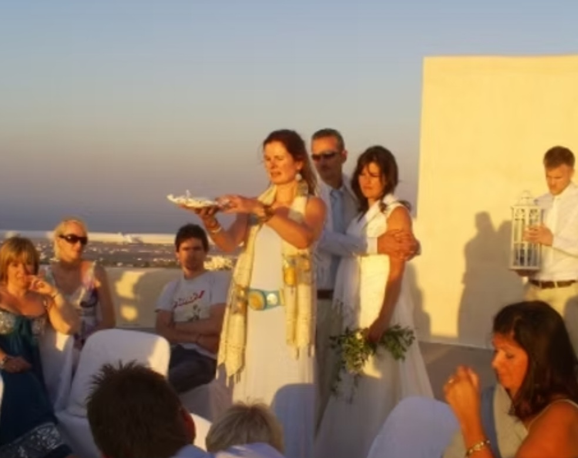

If you love Ireland, her natural world, and myths and stories, then you will love a wedding officiated by Temple Of Éiriú.

As our main focus is engaging with the spirit of Ireland and the natural world, there is no one better to marry you and  bring the magic of Ireland to one of the most special days in your life.

Even as mainstream religions become a less popular route for marriage, many couples still seek a spiritual element to their ceremony, finding some secular weddings too devoid of a certain something. That felt lack is usually to do with an absence of personal connection to the content of the service.

In the Temple of Éiriú, we guarantee you a deep and heartfelt connection to your ceremony. We design it together with you and your partner, so from beginning to end, it is like a piece of music that perfectly reflects your love and carries you with it. In times after your wedding, it is a space to return to, to sustain and strengthen your relationship. In other words, it has meaning for you that weaves a blessing and strong protection for your future together.

In preparation for your big day, we begin to gather the energy for your ceremony as soon as you agree to having us as solemniser.  We gather the strength of the elements and natural worlds to bring a potency to your marriage. In other words, we don't just rock up on the day; we take the time to get to know you, what is important to you in your life and we blend this with the spirit of this beautiful country of Ireland. Even couples who had been recommended to us via a friend and did not necessarily have an immediate connection with the land of Ireland, have all been blown away with the depth of emotion and heart within their marriage ceremony.

Please see our [Solmenisers](https://templeofeiriu.github.io/weddings-1) and [testimonials below](https://templeofeiriu.github.io/weddings-1)

Don't hesitate to contact us for any further information or questions you may have and yes very importantly we can legally register your marriage if that is what you want.

​

[You can find us listed as Registered Solmenisers here](https://www.gov.ie/en/publication/077ce8-register-of-solemnisers/)

Our Celebrants
--------------

Helping you create a wedding of beauty and heart

### Hilary Healy

Solemniser / Celebrant

### Trish Cameron

Solemniser / Celebrant

### Kay Gilliland

Solemniser / Celebrant

### Jay Ní Chiarrai

Solemniser / Celebrant

Testimonials
------------

“Mick and I aren't religious in any way, so it was really important for both of us to have someone capture our personalities and individualities, and we can categorically say that Trish did that and more! We can honestly say that the words she used on the day to express our love for one another, and our friends and family, brought a tear to many an eye"

### Leila & Mick Dumphy

'We didn't want a religious wedding but we still wanted to capture the special love and commitment that marriage is. With Kay as our celebrant we were able to convey a different type of spirituality, that of nature and human connection. Having an outdoor ceremony was important to us and we were able to design our ceremony which was really special. Kay gave us lots of ideas for our wedding and we decided hand-fasting, blessing of the rings by our guests, the lighting of candles by both families and then our own united flame were some of the elements we would include. We had lots of music and a general feeling of love and happiness permeated our ceremony and day. It was magical.'

### Lara and Cian

"Trish brought both the roots of Irish celticism and the meaning and importance of the day itself alive for us and all of our guests through beautiful words and symbolism.

She was a pleasure to work with from start to finish, helped form and lay out and plans around the ceremony and engaged people in a way I've never seen before with any other celebrant. Her words and blessings are regularly mentioned as one of the highlights of the day by our guests and her guidance and experience were both invaluable on the lead up and day itself."

​

### Michael O’Connor and Tim Lee

The wedding service that Trish performed for us was so personal, intimate and special that our guests still talk about it. We had a number of meetings with Trish, where we went through details regarding what type of service we wished to have. Trish took all our wishes on board and delivered an exceptional ceremony, which we will always remember. Trish is a very loving, warm,caring, gentle and professional person and my husband and I would not hesitate to recommend her to anyone.

### Giovanna and Frank Whelan

'Thank you so much Kay it was truly a dream come true for both of us. I can't thank you enough, you were so wonderful'

### Rebecca and Diamond

Thank you Trish for a very meaningful and personal wedding ceremony. Everyone loved it.  Our parents especially loved the way that the past and their families were brought into the marriage celebration. The standout for us was the meaning that you imparted into the ceremony. We have great memories from it.

### Jillian and Brian

I'm not great at putting things into words but my experience of our marriage ceremony was a magical day for me. It was spiritual, full of love and emotional. It was a day that I’ll never forget for the rest of my life.  
(Photo courtesy of Tony Swan)

### Maria and Richie

Trish worked with us to provide our dream wedding ceremony making the day very special and one we will remember forever. Her fluidity made it easy for us to include many of our friends and family in the ceremony which was very important, and really made the ceremony personal. Thank you so much.

​

### Anna and Dave McMahon

Trish Cameron brings an earthen presence to her role within all forms of marriage ceremonies. For us, it felt like her words were the words of the unspoken within the triumph of our special day. While we combined a hand-fasting ceremony with our blessing and civil marriage, it was Trish's holding of the sacredness of our union that was the most enjoyable for us, our family and friends.

### Eoin and Ruth O'Hagan

“Jay's ceremony was magical! Thank you for making our wedding truly special. It was really a dream come true to have Jay lead our wedding vows. She is warm, professional, caring, and a joy to work with.”

### Jennifer & Jason James

"Well what a ceremony!! Everyone is talking about it!!!"

### Karen and Brian

Frequently Asked Questions
--------------------------

### What type of ceremonies does the Temple of Éiriú offer?

Couples will be joined together by handfasting which is an older Irish way of pledging to each other. In this, the couple’s hands are connected with a traditional Irish weaving specially woven for weddings. It symbolises the bonding of hearts, minds, bodies and spirits.  
During this weaving together, the celebrant will bring the blessings of the elements (fire, earth, water and wind) for the couple’s life together.    
Others choose the more usual way and exchange rings. More often now, couples choose to do both, so combining the best of the Irish marriage traditions, old and new.

### What type of service can I expect from the Temple of Éiriú?

This is not just a service for the wedding day . There is an initial meeting with each couple to begin the process of crafting a ceremony. Where this is not possible,  skype and/or phone are used. It is important that the celebrant form a relaxed and trusting relationship with the couple. After this ,communication can be via email, phone or skype to bring the form of the ceremony into the design that the couple are happy with. The celebrant will, where possible, travel to the wedding venue prior to the big day. Within the Celtic Tradition, the celebrant begins to call for blessing for the couple and their lives together as soon as they decide on the Temple of Éiriú ceremony

### Where can the ceremony be performed?

The ceremony can be performed inside or outside. The space is honoured and made sacred to the elements and decorated with flowers, candles and perfumed with incense.

Contact
-------

To find out more information about weddings, ceremonies or teachings at Temple of Éiriú - Celtic Traditions, or if you would like to become a member, and receive our newsletter, please contact us today.