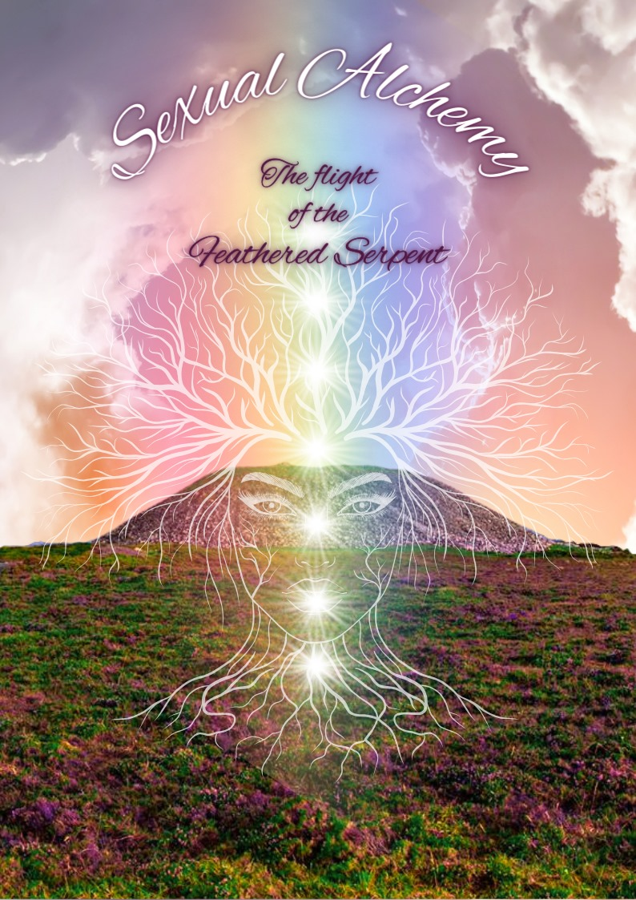
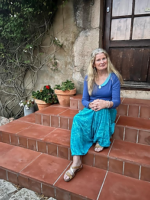
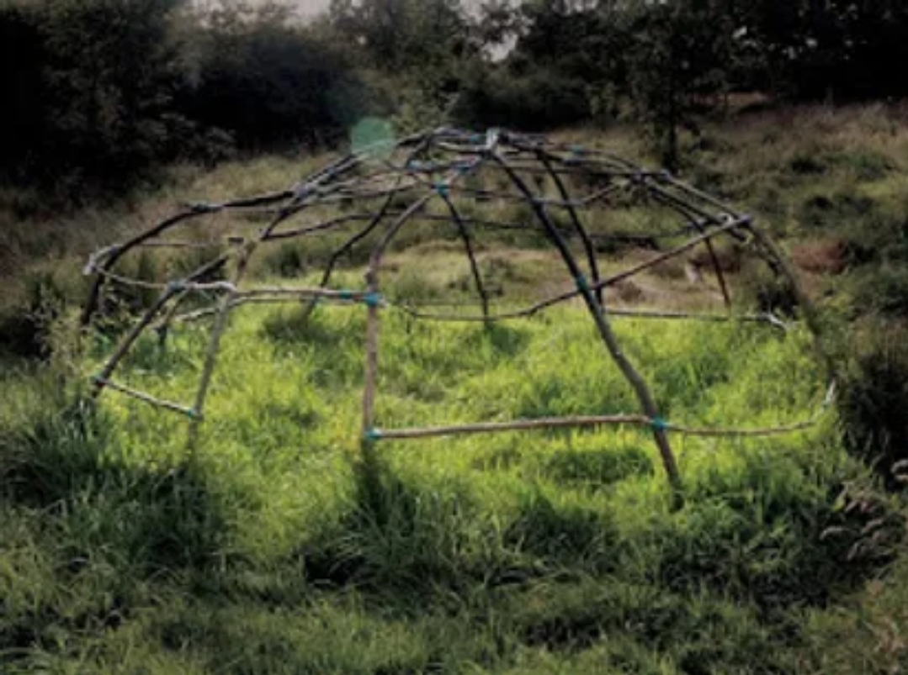
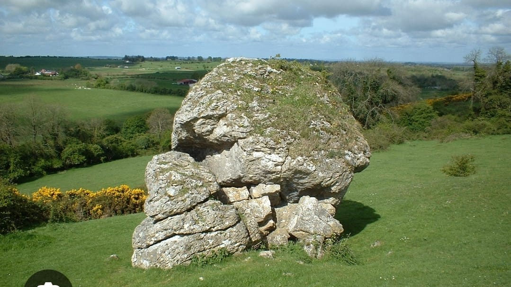
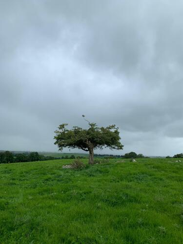
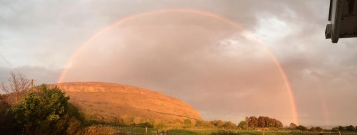
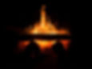
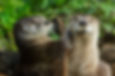

## The Flight Of The Feathered Serpent

New course starting in May 2025 - Enquire now to book your place

This is an in depth Apprenticeship Training Course for those who are called to facilitate Sacred Sexuality Circles for Women or to incorporate the teachings offered into their present chosen work. It is also for those who are currently holding circles and feel they need mentoring and support in this sacred work;  
Trish Cameron LightningStar has over 35 years experience working in this area in both the ordinary working world and in her Medicine (Shamanic) training.  
It is her wish to now impart what she has learned so that this valuable work can continue to nourish and support all Women in their empowerment and love of Self, and walking as a sacred human on the Earth at this time.  
This is not a training of simply imparting information, it is a journey for the self to embody wisdom. Sitting comfortably in your medicine is an offering of love and opportunity to others to do the same.  
The only 'agenda' of this Apprenticeship is to come home to the self, weaving together the ordinary & extraordinary, the Earth and Heaven, of who we are into harmony.  
To this end, there will be personal ceremonies focussed on dissolving the spaces inside self, where the war of self judgement still continues.  
This journey will settle you on the pathways of grace, of peace, of beauty & heart with the intention of you taking the courage to step into freedom.

The 'Everyday Goddess' which Star has been running for over 10 years has been offering this opportunity to women.  
Now it is time for some of you to take on this mantle should it call to you.  
Trish LightningStar 'I see each of you working these circles in your own unique way which is why most of the training is involved with inner work so that your 'medicine' can unfold and shine.  
This is the way of the Goddess; there are many paths of beauty to Oneness.'  
Should you be drawn to this , I'm very happy to chat with you to discern if this is the best path for you at this time.

Heart Blessings  
Star

For more information contact  
Karen OakHeartSinger [email](mailto://templeeiriu@gmail.com)

Ceremonial Workshops and Events
-------------------------------

The Temple of Éiriú holds events and ceremonies throughout the year some of which are outlined below.

These hold the intention of connecting us to the rhythm of Grandmother Earth, bringing us back into balance, and as an offering to Éiriú, Grandmother Earth and all of her worlds.

​

Sweat Lodge Ceremonies
----------------------

Sweat Lodge Ceremonies

The Sweat Lodge ceremony has been performed by indigenous peoples upon this land and around the world from ancient times up to the present. It is a simple and powerful antidote to the mind maze of our modern Western culture. It purifies, restores and opens to our heart bonding with life, to experience our lives as a gift and a blessing. The ceremony clarifies our path in life and strengthens us to take the steps we need to celebrate our lives and bring them into balance.

​

If any community is interested in building their own Sweat Lodge, please get in touch as we are willing to advise.

​

For information [on future sweat lodges when they become available](https://templeofeiriu.github.io/workshops) [please click here](https://templeofeiriu.github.io/workshops), or become a member and we will keep you updated

Weavers of the Grail (Year One)
-------------------------------

On this course you will deepen in service to the divine feminine and learn:

*   how to connect with your sisters in a circle to weave blessings and beauty
    
*   to connect in ceremony with the natural world
    
*   how to feel and sense these energies in your body
    
*   about focus and intent for ceremony
    
*   where your strengths and challenges lie
    
*   how to introduce yourself to a sacred size
    

​

The next course will begin in September 2022. For more information please contact Sylvia, HeartofFire on 0863870578 or email [sylviaroche@yahoo.com](mailto:sylviaroche@yahoo.com)

Weavers of the Grail (Year Two)
-------------------------------

On this course you will learn:

*   how to read the response from the site
    
*   how to lead yourself and others in safety and in co-creation with the site
    
*   to build and balance an alter
    
*   to invoke and call on sacred presence
    

You will also begin the quest:

*   for a sacred item
    
*   for animal, mineral, plants and ancestral allies
    

​

Pilgrimages
-----------

Ireland is majestic and wild ,seducing us into her magic. She is feral and edgy yet softly embracing, vulnerable and powerful, She is willing to lead you into the emerald heart of the land, to the ancient fires of ecstasy and the quiet pool of reflection. You can journey into her peace, reclaiming your sovereignty and your own authentic voice. She is fluid like the spiralling rhythms of the land, leading you into the dance of faery,deep into the green Sidhe mounds.Her voice is haunting, once heard, never forgotten as she will speak to you in dream no matter how far away.

​

To organise a pilgrimage or find out more, please [contact us](mailto:templeofeiriu@yahoo.com)

<!-- Fire Teachings
--------------

These teachings are for those who hold the earth as sacred and understand the power of fire to transmute and transform. They are designed for us to assess our own internal fire and brings through a message of awakening, hope, creativity and passion.

​

For information on upcoming Fire Teachings please [contact us](https://templeofeiriu.github.io/)

 -->

<!-- Dance of the Animals
--------------------

This will be done with respect, gratitude, and in celebration of the unceasing contribution that our animal brothers and sisters make to our well-being.

​

If you are interested in learning more about this workshop, please contact us @ [templeeiriu@gmail.com](mailto://templeeiriu@gmail.com)

 -->

<!-- Awakening Wisdom
----------------

Spring 2023

Women's shamanic wisdom circle. A three part cycle of teachings, focusing on nature's rhythms and expression through the Goddesses of Ireland.   Participants will have an opportunity to receive  teachings, guided shamanic journeying, rituals for personal practice, and shared group experience.

Facilitated by Trish Cameron, also known by her medicine name LightningStar. She is a medicine woman of over thirty years experience within the indigenous traditions of Éiriú (Ireland). Her passion is the reawakening of the ancient wisdom and spirit within the land and the people, with particular focus on the Divine Feminine Energies.

Saturdays 10am-4.30pm,   Feb 11th,   March 25th,   April 22nd,   Ashford, Co Wicklow,

Fee: €210 if booked by Jan 31st/ €240 thereafter   (€40 booking) payments can be in instalments. 

 -->

Contact
-------

To find out more information about weddings, ceremonies or teachings at Temple of Éiriú - Celtic Traditions, or if you would like to become a member, and receive our newsletter, please contact us today @ [templeeiriu@gmail.com](mailto://templeeiriu@gmail.com)
