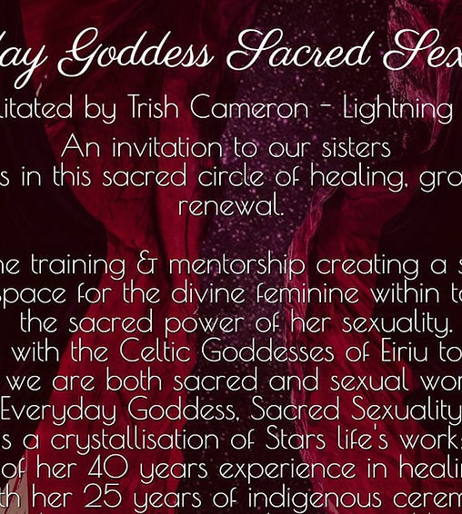

Sat, 03 Sept

|Online event

'The Everyday Goddess' is online training and mentorship, healing the sexual and spiritual aspects of ourselves

Tickets are not on sale

[See other events](https://templeofeiriu.github.io/)

Time & Location
---------------

03 Sept 2022, 10:00

Online event

About the event
---------------

Everyday Goddess Sacred Sexuality facilitated by Trish Cameron - Lightning Star

An invitation to our sisters to join us in this sacred circle of healing, growth and renewal.

An online training and mentorship creating a safe and nurturing space for the divine feminine within to return to the secret power of her sexuality.

Journeying with the Celtic Goddesses of Éiriú to rediscover that we are both sacred and sexual women.

Everyday Goddess Sacred Sexuality is a crystallisation of Star’s life work:

A blending over 40 years experience in healing women’s sexuality with her 25 years of indigenous ceremonial work. We joined together in autumn, to be nurtured by the loving energies of the rose through the dark of the winter, into the rebirthing energies of spring. We receive nourishment collectively in sacred circle and personally through an individual mentoring session with Star.

Running monthly on Saturdays from 10:00 AM to 5:00 PM.

*   

