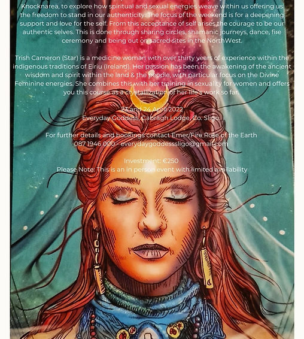

Sat, 23 Apr

|Coolaney

## Everyday Goddess

This is an invitation to spend a weekend in the company of the Goddess Medbh of Knocknarea, to explore how spiritual and sexual energies weave within us offering us the freedom to stand in our authenticity. The focus of the weekend is for a deepening support and love for the self. From this acceptan

Tickets are not on sale

[See other events](https://www.templeofeiriu.ie/)

Time & Location
---------------

23 Apr 2022, 09:00 – 24 Apr 2022, 17:00

Coolaney, Cabragh Lodge, Cabragh, Coolaney, Co. Sligo, Ireland

About the event
---------------

This is an invitation to spend a weekend in the company of the Goddess Medbh of Knocknarea, to explore how spiritual and sexual energies weave within us offering us the freedom to stand in our authenticity. The focus of the weekend is for a deepening support and love for the self. From this acceptance of self arises the courage to be our authentic selves. This is done through sharing circles, shamanic journeys, dance, fire ceremony and being out on sacred sites in North West.

Trish Cameron (Star) is a medicine woman with over thirty years of experience within the indigenous traditions of Eiriu (Ireland). Her passion has been the reawakening of the ancient wisdom and spirit within the land & the people, with particular focus on the Divine Feminine energies. She combines this with her training in sexuality for women and offers you this course as a crystallization of her life’s work so far.

Everyday Goddess, Cabragh Lodge, Co. Sligo

Please Note: This is an in person event with limited availability

*   

