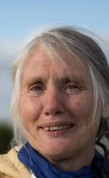
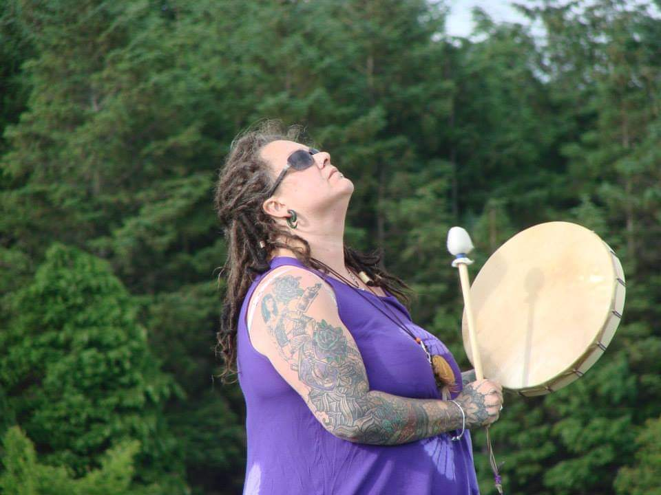

We invite you to join us at An Nead in West Wicklow, on Saturday 1st of Feb, the site of the Aisling Eala dance, to join with us again in drumming to the land in the morning, seeing whats emerging in this time of welcoming and weaving with Bridget, followed by crawling into the sweat lodge in the afternoon.
The intent of this day is to continue our work of remembering ourselves, our light and our connections, and to bring all that we have learned through this time of deep Winter Dreaming.

To take the time to gather our blessings, individually and collectively, and to anchor them for ourselves and all our relations.

Please feel free to bring along your own drum/ rattles, but not a requirement either.

To join us please let us know by email to templeeiriu@gmail.com.
Contribution requested is 65e,cash on the day, however no one is refused due to finances.
If you require a concession please let me know.

Hilary Healy EarthDragún lives in West Wicklow, where she tends her land including the young forest, which delights her heart. She has worked and trained with a few different traditions over the past 30 years and acknowledged as a Grandmother Elder, always with the intent to remember ourselves and our own traditions on this land of Éiriú.

Karen Minchin OakHeartSinger, I am a mother, Bean Feasa, and Song Carrier weaving together chants from the indigenous traditions I walk with. I have worked within community medicine circles for many years, and found home in the Temple of Éiriú, as lead ceremonial drummer for the Aisling Eala. Sitting with the sacred drum, allowing for the re-emergence of the ancient connection to the heartbeat of the land.
