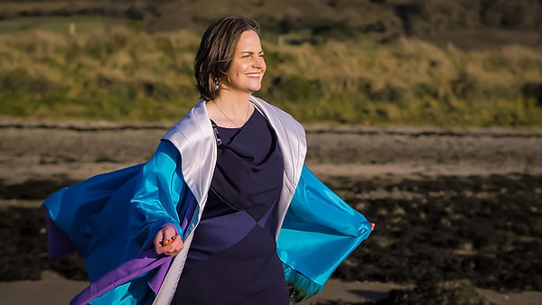

Helen Cantrell
Helen is a Physical Therapist, Energy Therapist, Healer and Singer/Songwriter. 

Her healing and spiritual awakening began in 2009 while attending a spiritual retreat in the USA with an Indian Saint and Satguru Amma. Inspired by this meeting and the depth of transformation it offered Helen was curious to find something of the same caliber in Ireland. After much questing and a trip to India she joined a shamanic school in 2011 founded by Arwyn Larkin, a medicine woman and healer of Irish and Native American Shamanic Traditions. 

Over the next 12 years as part of this shamanic path, Helen learnt the ancient ways and traditions of this land and the Medicine traditions of North and South America while also completing many personal shamanic ceremonies. Many spiritual practices were practiced and learnt but she found that singing offered the depth of connection she was longing for with spirit and her heart. 

Over the years she has developed and explored this connection through with her singing voice, learning and teaching Medicine Songs and Mantras from different indigenous tribes and traditions. Influenced by the different qualities that each song and mantra carries she has also composed many of her own and recorded 3 songs dedicated to the Goddess. Her recent release in 2023 ‘Brigid of the Flame’ celebrates the Brigid we all love and know of this land – Goddess, Saint, Poet, Healer, Seer. 

Helen has a wealth of experience holding sacred space having been lead singer, drummer and musical director at a number of shamanic peace dances held in both Ireland and Wales. She has held Medicine song circles in Sligo for over 8 years and is so happy to share, teach and sing songs with others in a group setting which really help to uplift the spirit, reconnect us to our hearts and to what is important in our lives. 
